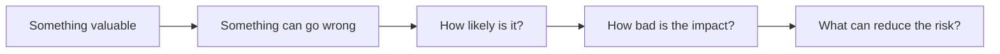
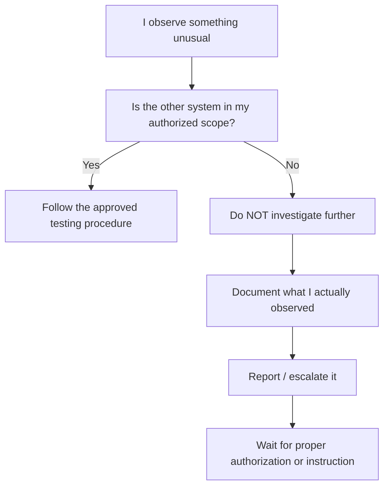
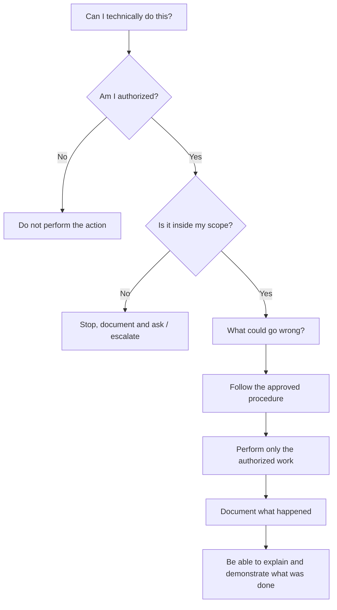

# 🛡️ GRC — DAY 01

## Before the Tool, Know the Boundary

**Learning Track:** Governance, Risk & Compliance
**Focus:** GRC fundamentals • IT Act, 2000 • Authorization • Scope • Professional responsibility

---

> [!IMPORTANT]
>
> ### The one idea I am taking from Day 1
>
> **Just because I am technically capable of doing something does not mean I am authorized to do it.**
>
> Before touching a system, I should know:
>
> **Who authorized me? What exactly am I allowed to do? What can go wrong? Where do I stop?**

---

## 📍 Why I Started Learning GRC

Until now, most of my cybersecurity learning has been technical.

I was learning Linux, Bash, processes, commands, security tools and eventually I will move deeper into networking and security.

So naturally, when I thought about cybersecurity, my mind went toward questions like:

> How does this tool work?

> How can I scan this?

> How can someone attack this?

> How do we defend it?

Today's class added another question that should actually come **before** many of those:

> **Am I even authorized to do this?**

That was the main point I understood from my first GRC session.

Cybersecurity is not only about having skills.

It is also about knowing **where I am allowed to use those skills**.

---

# 01 — What is GRC?

**GRC = Governance, Risk and Compliance.**

I don't want to remember these as three dictionary definitions.

This is how they currently make sense in my head.

|                    | The question I ask myself                                                                    |
| ------------------ | -------------------------------------------------------------------------------------------- |
| 🏛️ **Governance** | Who decides? Who is responsible? What am I permitted to do?                                  |
| ⚠️ **Risk**        | What can go wrong? How can it happen? How bad could the impact become?                       |
| ✅ **Compliance**   | What rules or requirements must be followed, and can we show that we actually followed them? |

---

## 🏛️ Governance — Who gets to decide?

For me, governance starts with:

> **Who has the authority?**

Suppose somebody asks me to test a company's server.

My first thought should not simply be:

> "Okay, he works there. Let me start."

I need to know whether that person actually has the authority to allow the testing.

Someone being an employee does not automatically mean they can authorize a penetration test.

Someone knowing the password does not mean they own the system.

Someone being my manager does not mean every instruction they give automatically becomes legal or permitted.

So I learned to separate these things:

```text
Someone asked me
        ≠
Proper authorization

I know the password
        ≠
Permission

The system is reachable
        ≠
Permission

I know how to attack it
        ≠
Authority to attack it
```

Governance, in my current understanding, gives structure to **who can make these decisions and who is responsible for them**.

---

# 02 — Risk — What could go wrong?

Risk sounded simple at first.

Something dangerous can happen.

But during the discussion, I started looking at it differently.

If I am given access to a system, I should also think:

* What information exists there?
* Who could be affected?
* Could I accidentally expose something?
* Could I delete or corrupt something?
* Could my testing interrupt a service?
* Could I access information that was never part of my work?
* What would happen if this access was misused?

So now I think about risk roughly like this:



For example, imagine an account accidentally has access to employee salary data, identity information and medical information.

The issue is not simply:

> "Oh, the folder is visible."

I should think about what could happen **because** it is visible to someone who should not have access.

That is where risk begins making practical sense to me.

---

# 03 — Compliance — Don't Just Say You Followed the Rules

My first understanding of compliance was basically:

> "Be responsible and follow the rules."

That is part of it, but now I understand there is another important question:

> **Can we show that we followed the requirement?**

A company cannot always say:

> "Trust us. We secured everything."

There may need to be:

* approvals,
* policies,
* logs,
* records,
* reports,
* access reviews,
* documentation,
* or other evidence.

So the way I currently remember compliance is:

```text
What am I required to follow?
              ↓
Did I actually follow it?
              ↓
Can I demonstrate that I followed it?
```

This is something I want to understand much deeper as I continue GRC.

---

# 04 — The IT Act, 2000: What I Took From It

Today I was introduced to India's **Information Technology Act, 2000**.

I am not trying to memorize every section of the Act on Day 1.

That was not even the main lesson my instructor wanted me to take.

What mattered to me was understanding **why cybersecurity professionals need some awareness of the law**.

As computers, electronic records, online communication, banking, digital transactions and Internet-based services became part of normal life, there also had to be a legal framework around activities performed electronically.

For me as a cybersecurity learner, the Act introduces an important boundary:

> **The digital world is not a law-free playground.**

Just because I am sitting behind my laptop does not mean my actions suddenly have no consequences.

---

## Section 43 — The Only Section I Want to Remember for Now

I do not want this Day 1 entry to become:

```text
43
43A
65
66
66C
66D
66F
...
```

That would defeat the point of what I actually learned.

For now, **Section 43** is enough for me to remember at a beginner level.

My understanding is that it deals with certain activities involving computers, computer systems, networks and data when done **without proper permission**, including things such as unauthorized access and certain forms of copying, interference, damage or misuse.

But even here, the number `43` is not my biggest takeaway.

My bigger takeaway is:

> **Permission matters.**

---

# 05 — The Example That Made Authorization Click for Me

Imagine I am renting a room in someone's house.

The owner gives me the key to **my room**.

One day, while walking through the house, I notice that the owner's private room is open.

The door is physically open.

I am physically capable of walking inside.

But does that mean:

> "The owner has authorized me to enter"?

**No.**

Maybe he forgot to close the door.

Maybe somebody else left it open.

Maybe there is another reason.

The important thing is:

> **An open door is a condition. It is not permission.**

That is exactly how I started thinking about computer systems.

```text
The system lets me do it
            ≠
I am authorized to do it
```

---

# 06 — Knowing a Password Doesn't Make Me Authorized

Suppose somebody's Wi-Fi password is visible on a wall.

I see it.

Now I **know the password**.

That still does not automatically mean I have permission to connect.

This helped me understand an important distinction.

### Authentication

> **Who are you?**

A username and password may allow a system to identify or authenticate me.

### Authorization

> **What are you actually allowed to do?**

Those are not the same thing.

```text
Authentication
"I successfully entered."

        ≠

Authorization
"I am permitted to perform this action."
```

Knowing credentials is not ownership.

Having credentials is not permission.

Successfully logging in is not unlimited authority.

---

# 07 — The HR Folder Scenario

Suppose I work for a company and my manager gives me a legitimate test account.

My task is only to verify the login system of an internal application.

I log in successfully.

But because somebody configured the permissions incorrectly, I notice that the same account can access an HR folder containing:

* salaries,
* employee addresses,
* identity information,
* medical information.

The computer technically lets me open it.

One way of thinking would be:

> "If they didn't want me to see it, they should have blocked it."

After today's discussion, I don't agree with that reasoning.

The system allowing something does not mean a human authorized me to do it.

So I would not start exploring the HR files.

I would stop.

I would check what I was actually authorized to test and report the unexpected access through the proper channel.

### My rule:

> **When I am uncertain about access, I should not explore deeper to remove my uncertainty. I should stop and verify the authorization.**

---

# 08 — Scope: Permission Also Has Limits

This was probably the most important new professional term for me.

**Scope** means the defined boundary of what I am allowed to test or access.

Imagine a company gives me written authorization to penetration test:

```text
test.example-company.com
```

During the work, I somehow notice another system:

```text
payroll.example-company.com
```

Maybe I notice something that makes me suspect there could be a security problem.

My colleague says:

> "Both belong to the same company. We're already authorized by the company. Let's quickly check payroll too."

I would say **no**.

Why?

Because I was authorized to test:

```text
test.example-company.com
```

I was **not** authorized to test:

```text
payroll.example-company.com
```

The fact that the same company owns both does not automatically expand my scope.

---

## 🤔 Why Not Just Help Them?

There could be many things happening that I do not know about.

Maybe:

* another security team is already testing payroll;
* payroll contains highly sensitive employee information;
* the organization intentionally excluded it;
* testing could interrupt an important service;
* there are different contractual restrictions;
* the system has a completely different owner internally;
* there is an investigation happening that I know nothing about.

And that itself taught me another lesson:

> **I should not turn assumptions into authorization.**

---

# 09 — What If I Accidentally Notice a Possible Vulnerability?

This was another scenario I thought through.

Suppose while testing the authorized application, I see enough information to suspect that the payroll application may also have a vulnerability.

My response would **not** be:

> "Great. Let me test it and prove it."

Instead:



There is also a difference between saying:

> **"Payroll has a vulnerability."**

and saying:

> **"I observed something that may indicate an issue affecting payroll, but payroll was outside my testing scope and I did not investigate further."**

The second one is more accurate.

I am separating:

```text
What I actually saw
        ↓
What I think it might mean
        ↓
What would need investigation
        ↓
Whether I am authorized to perform that investigation
```

And one sentence from this discussion is worth keeping:

> **Finding something gives me a reason to report it. It does not automatically give me permission to investigate it.**

---

# 10 — The Client Gives Me a Phone or Computer

Another example I thought about:

Suppose a client gives me their device and says:

> "I think this suspicious file is causing a problem. Please find it and remove it."

That does not mean:

> "Go through everything on my device."

If my responsibility is to investigate a particular suspicious file, I should work within that responsibility.

It does not suddenly give me permission to copy:

* personal photos,
* messages,
* unrelated documents,
* credentials,
* or other private information.

The device may physically be in my hands.

I may technically be capable of accessing everything.

But my **task has a purpose and a boundary**.

This made the idea of scope even clearer to me.

---

# 11 — What Nmap Made Me Think About

Suppose I learn Nmap very well.

Now I can scan networks and discover hosts, ports and services.

A beginner might think:

> "I am only scanning. I am not deleting anything. I don't have bad intentions."

But today I understood that **my intention is not the only question**.

There is another question before it:

> **Do I have permission to test that system?**

If I want Nmap practice, I can use:

* my own machines,
* my own virtual lab,
* intentionally vulnerable systems,
* cybersecurity training platforms,
* or environments where I have explicit authorization.

There is no need to experiment on random people's systems.

---

# 12 — Critical Systems Changed How I Think About Cybersecurity

Another thing discussed today was how dependent countries have become on technology.

Things like:

* power,
* telecommunications,
* transportation,
* banking,
* defense,
* government systems

can be extremely important to the functioning of a country.

Before, national defense made me mainly think about borders, military equipment and soldiers.

Cybersecurity adds another dimension.

Modern countries also need people protecting the digital systems that important services depend on.

I am still at the beginner stage here, so I do not want to make huge claims or pretend I understand critical infrastructure security after one session.

But the idea itself was important:

> **Cybersecurity can affect much more than one laptop. Digital systems can support services that entire populations depend on.**

That also explains why randomly experimenting with systems you do not own can become much more serious than a beginner might imagine.

---

# 13 — “But I Didn't Mean Any Harm”

This was probably the biggest shift in my thinking.

A beginner could say:

> "I wasn't trying to steal anything."

> "I was only curious."

> "I was only scanning."

> "The password was already visible."

> "The server allowed me inside."

> "Both systems belong to the same company."

> "I was just trying to help."

But none of these automatically answer the real question:

> **Were you authorized?**

Good intentions do not automatically create permission.

Technical access does not automatically create permission.

Curiosity does not create permission.

Capability does not create permission.

---

# 14 — What Changed in My Thinking Today?

| Before this session                                                   | What I understand now                                                              |
| --------------------------------------------------------------------- | ---------------------------------------------------------------------------------- |
| Cybersecurity is mostly about learning attack and defense techniques. | Technical ability is only one part. Legal and professional boundaries matter too.  |
| If I don't damage anything, checking something may be harmless.       | Before asking about damage, I should ask whether I am authorized.                  |
| If I know the password, I can probably use it.                        | Knowing credentials and being authorized are different things.                     |
| If a system lets me access something, maybe I am allowed to see it.   | A technical permission mistake does not create real authorization.                 |
| If a company hires me, I can probably test its systems.               | Authorization has a specific **scope**.                                            |
| If I find another security issue, I should investigate it.            | I can report an observation without crossing my authorized boundary.               |
| If someone tells me to do something, I can proceed.                   | I should know whether that person actually has authority to give that instruction. |
| Good intention protects me.                                           | Good intention does not replace authorization, scope or proper procedure.          |

---

# 15 — My Day 1 Decision Model

This is probably the simplest way I can represent everything I understood today:



---

# 🧠 The Mental Model I Am Leaving Day 1 With

```text
              TECHNICAL ABILITY
                 Can I do it?
                     │
                     ▼
               AUTHORIZATION
                Am I allowed?
                     │
                     ▼
                   SCOPE
           What exactly can I do?
                     │
                     ▼
                    RISK
            What could go wrong?
                     │
                     ▼
             RULES / PROCEDURE
              How should I do it?
                     │
                     ▼
               ACCOUNTABILITY
        Can I explain what I did and why?
```

---

# 💭 Final Reflection

The biggest thing I learned in my first GRC class was **not Section 43**.

It was not memorizing the IT Act.

It was not memorizing definitions.

It was learning that before becoming good at using cybersecurity tools, I also need to become good at knowing **when I should and should not use them**.

I want technical capability.

But capability without judgment can become a problem.

So from Day 1, this is the principle I want to carry forward:

> [!IMPORTANT]
>
> ## **Just because I can does not mean I am authorized.**
>
> **Access ≠ Permission**
> **Credentials ≠ Permission**
> **Discovery ≠ Permission to investigate**
> **Capability ≠ Authority**

And when I don't know whether I am allowed to do something:

> **I don't assume. I stop, check my scope, ask the proper person and continue only when the boundary is clear.**

That is what GRC started meaning to me on Day 1.

---

### Learning Note

This page records **my understanding after my first GRC session**. I am intentionally documenting how my thinking develops instead of pretending that one class made me an expert in cybersecurity law or GRC.

As I learn more, I expect some of these ideas to become more precise.

**That is the point of documenting the journey.**
