# 🛡️ GRC — DAY 02

## From Protecting Systems to Understanding What Happens When They Are Compromised

**Learning Track:** Governance, Risk & Compliance
**Focus:** Critical Information Infrastructure • NCIIPC • Electronic Evidence • Ransomware • Encryption • Data Exfiltration • Organisational Responsibility

---

> [!IMPORTANT]
>
> ### 💡 The one idea I am taking from Day 2
>
> **Recovering a system does not automatically mean the incident is over.**
>
> If an attacker steals customer data before encrypting the systems, restoring those systems from backup may bring the organisation back online — but it does **not** take the stolen information back.
>
> So I should also ask:
>
> **What was stolen? How did the attacker enter? Is that path still open? Who is affected? What responsibility still remains?**

---

# 📍 Where Day 2 Continued From Day 1

Day 1 mainly changed the way I thought about **authorization and scope**.

My main rule was:

> **Just because I can do something does not mean I am authorized to do it.**

Day 2 moved one step further.

Instead of only asking:

> **"Am I allowed to touch this system?"**

I started thinking about:

> **"What happens when an important system is actually compromised?"**

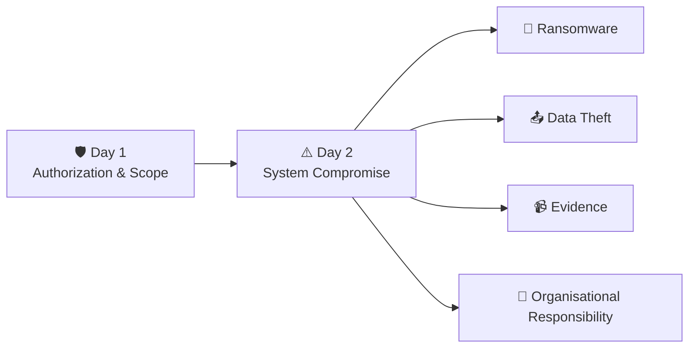

This made GRC feel less like separate legal terms and more like something connected to actual cybersecurity incidents.

---

# 01 — 🏛️ Critical Information Infrastructure

Today I learned that some digital systems are much more important than one computer or one organisation.

Examples include systems supporting:

* ⚡ power and energy,
* 📡 telecommunications,
* 🚆 transportation,
* 🏦 banking and financial services,
* 🏛️ government systems,
* 🛡️ strategic systems,
* 🏭 important public enterprises.

If my personal laptop stops working, the impact may mostly affect me.

But if systems supporting electricity, banking, telecommunications or transportation stop working, the impact can spread across organisations and large numbers of people.

### 🧠 How I currently think about it

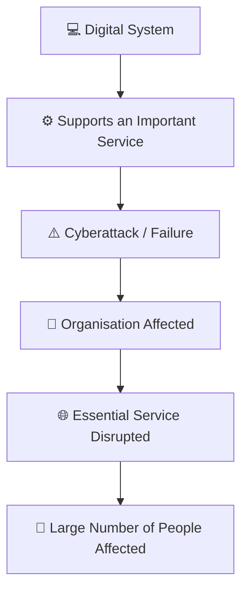

So the real question is not only:

> "How important is this computer?"

It is also:

> **"What important service depends on this computer?"**

That changed how I look at critical infrastructure.

---

# 02 — 🛡️ NCIIPC

I was introduced to:

## **NCIIPC — National Critical Information Infrastructure Protection Centre**

It operates under:

**NTRO — National Technical Research Organisation**

My beginner understanding is that NCIIPC acts as India's national nodal organisation for the protection of **Critical Information Infrastructure**.

I am not trying to memorise every responsibility after one class.

The larger idea makes more sense to me:

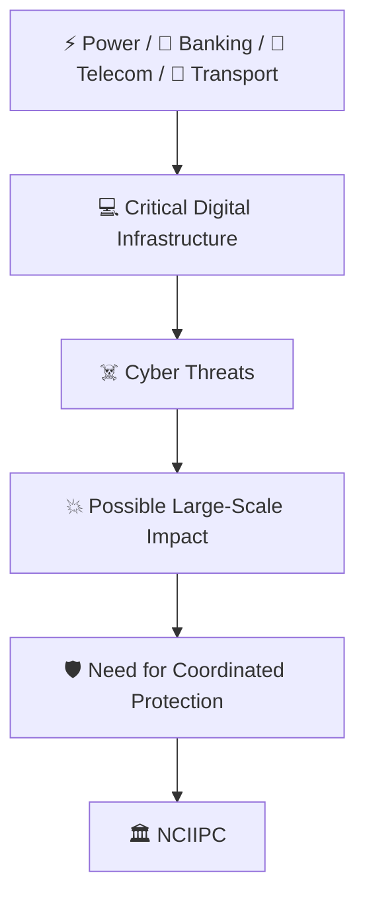

> **When digital systems support nationally important services, their protection cannot depend only on one individual security engineer. It needs organised coordination.**

---

# 03 — 🎭 Fake Website / Online Scam Example

My mentor showed an example involving a fake shopping website designed to look similar to a real website such as Myntra.

The important lesson for me was:

```text
Looks genuine
     ≠
Is genuine
```

A fake website may copy:

* 🎨 colours,
* 🖼️ logos,
* 🛍️ product images,
* 📄 layouts,
* 💰 discounts,
* 💳 payment pages.

A person may trust it simply because it **looks familiar**.

So before transferring money, especially when someone suddenly moves the conversation to random:

* WhatsApp,
* Telegram,
* unofficial payment links,
* or personal accounts,

I should verify the organisation and use proper channels.

### 🔗 Connection to Day 1

Day 1:

```text
I can access it
      ≠
I am authorized
```

Day 2:

```text
It looks genuine
      ≠
It is legitimate
```

Both taught me something similar:

> **Never convert an assumption into trust.**

---

# 04 — 📹 Electronic Evidence

Another major topic was electronic evidence.

Before this discussion, I might have thought:

> "If CCTV recorded the incident, then we have the evidence."

But now I understand there are more questions.

For example:

* 📱 What device created the evidence?
* 🎥 What was that device being used for?
* 🕐 When was the record produced?
* ⚙️ Was the device functioning properly?
* 📁 Was the record created during normal operation?
* ✂️ Has the evidence been modified?
* ✍️ Who is identifying or certifying the record?

So:

> **Possessing an electronic file does not automatically prove that the file is reliable evidence.**

---

# 05 — 🔍 My CCTV Evidence Example

Suppose CCTV records an incident.

Before investigators receive the footage, someone removes **three seconds** from it.

The remaining footage may still look completely normal.

But those three seconds might contain something important.

More importantly:

> **The evidence itself has been altered.**

My analogy was:

> 🗡️ **It is like wiping fingerprints from a knife before investigators examine it.**

The knife still exists.

But somebody has interfered with evidence that investigators were supposed to inspect.

### My current evidence flow

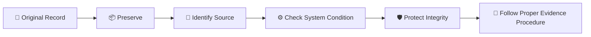

For me, this introduced the idea of **evidence integrity**.

---

# 06 — ⚖️ Legal Note I Corrected After Class

> [!NOTE]
>
> I am deliberately separating what I heard in class from what I verified afterward.

In class, electronic evidence was discussed using:

**Section 65B**

I later learned that Section 65B belonged to the older **Indian Evidence Act, 1872**.

India now uses the **Bharatiya Sakshya Adhiniyam, 2023**, which came into force on **1 July 2024**.

The corresponding current provision dealing with electronic records is **Section 63**.

So my notes changed from:

```text
Classroom reference
        ↓
Section 65B
```

to:

```text
Current legal framework
        ↓
Bharatiya Sakshya Adhiniyam, 2023
        ↓
Section 63
```

The bigger lesson for me is:

> **I should understand what a law is trying to address instead of blindly memorising section numbers.**

---

# 07 — 🔐 Ransomware

The most interesting topic for me today was **ransomware**.

My mentor explained it using a bank.

Imagine:

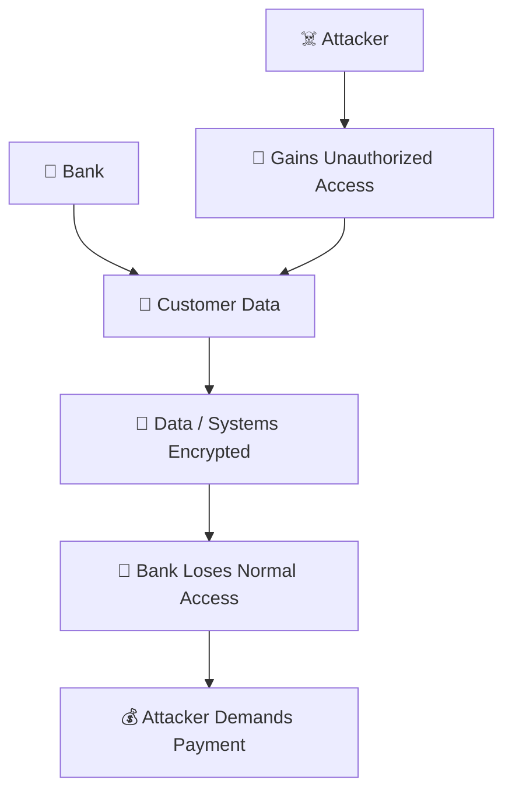

My simple understanding is:

> **An attacker compromises an organisation, takes away normal access or control over systems/data, and demands money to restore that access or control.**

But then I started questioning the example.

---

# 08 — 💾 "What If the Bank Has a Backup?"

My first thought was:

> "If the bank has a backup, why should it care about the attacker's encrypted copy?"

The bank could restore the system.

That sounds like the problem is solved.

But then I realised something.

What if the attacker **copied the customer information before encrypting the systems?**

Now there are two separate problems.

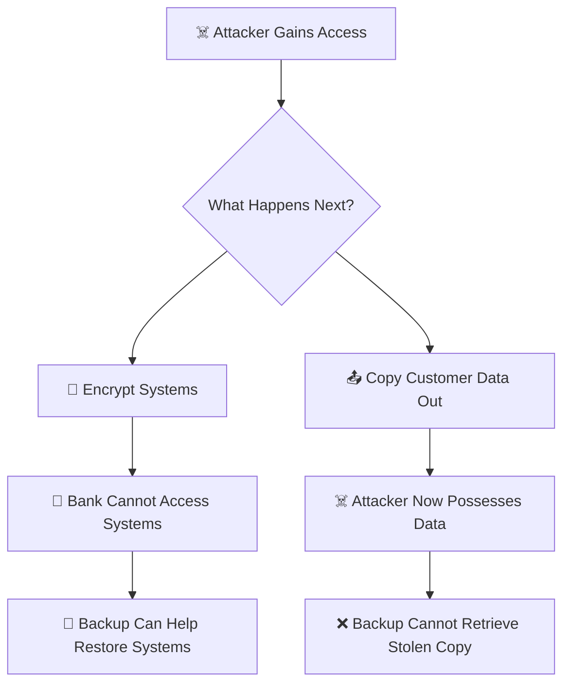

That was probably the biggest ransomware realization I had today.

---

# 09 — 📤 Exfiltration

The technical word I learned for the second path is:

## **Data Exfiltration**

My simple understanding is:

> **Data exfiltration means data is copied or moved outside the environment where it belongs without authorization.**

Example:

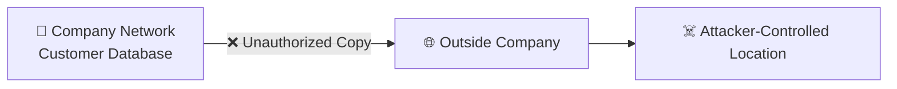

The company may still have the original database.

But the attacker now has another copy.

That still counts as exfiltration.

---

# 10 — 🔐 Encryption vs 🔓 Decryption vs 📤 Exfiltration

This was one of my biggest terminology corrections today.

### 🔐 Encryption

Readable information becomes ciphertext.

```text
Readable Data
     ↓
 Encryption
     ↓
Ciphertext
```

---

### 🔓 Decryption

Ciphertext becomes readable information again using the correct key/process.

```text
Ciphertext
     ↓
 Decryption
     ↓
Readable Data
```

---

### 📤 Exfiltration

Information is copied or moved outside the organisation without authorization.

```text
Company Data
     ↓
Unauthorized Copy / Transfer
     ↓
Outside Location
```

### 🧠 My final distinction

| Action              | What it means                                                      |
| ------------------- | ------------------------------------------------------------------ |
| 🔐 **Encryption**   | Make readable information unreadable using cryptography            |
| 🔓 **Decryption**   | Convert encrypted information back into readable information       |
| 📤 **Exfiltration** | Move/copy information outside an environment without authorization |

---

# 11 — ❌ My "Siphoning" Misunderstanding

At first I thought:

> **Siphoning data = encrypting data**

That was incorrect.

If someone says information was **siphoned out**, they are talking more about information being taken or diverted away.

The more precise cybersecurity term in this situation is:

**Data Exfiltration**

So now my mental model is:

```text
Data transformed
      ↓
Encryption 🔐

Data taken outside
      ↓
Exfiltration 📤
```

I want to preserve this mistake in my portfolio because it shows where my understanding actually changed.

---

# 12 — 🧪 My Exfiltration Understanding Check

I was given this scenario:

> An attacker copies 20,000 customer records from a company database to a server they control but does not encrypt anything.

Has exfiltration occurred?

My answer:

**Yes. ✅**

Because the data has been copied outside the organisation without authorization.

Encryption has nothing to do with whether exfiltration occurred.

### The important separation

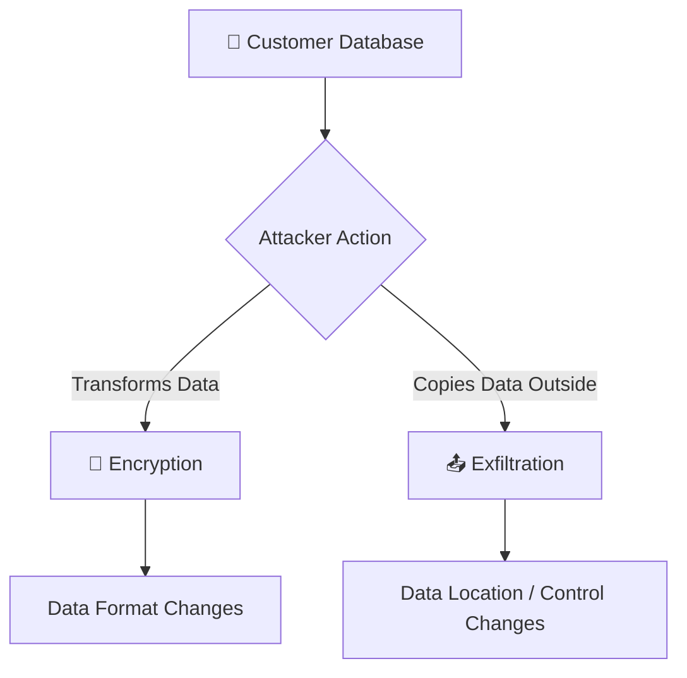

That diagram is probably the easiest way for me to remember the difference.

---

# 13 — 💥 Ransomware Can Create Multiple Problems

I originally saw ransomware as:

```text
Encrypt Data
     ↓
Demand Money
```

Now I understand a more complex situation:

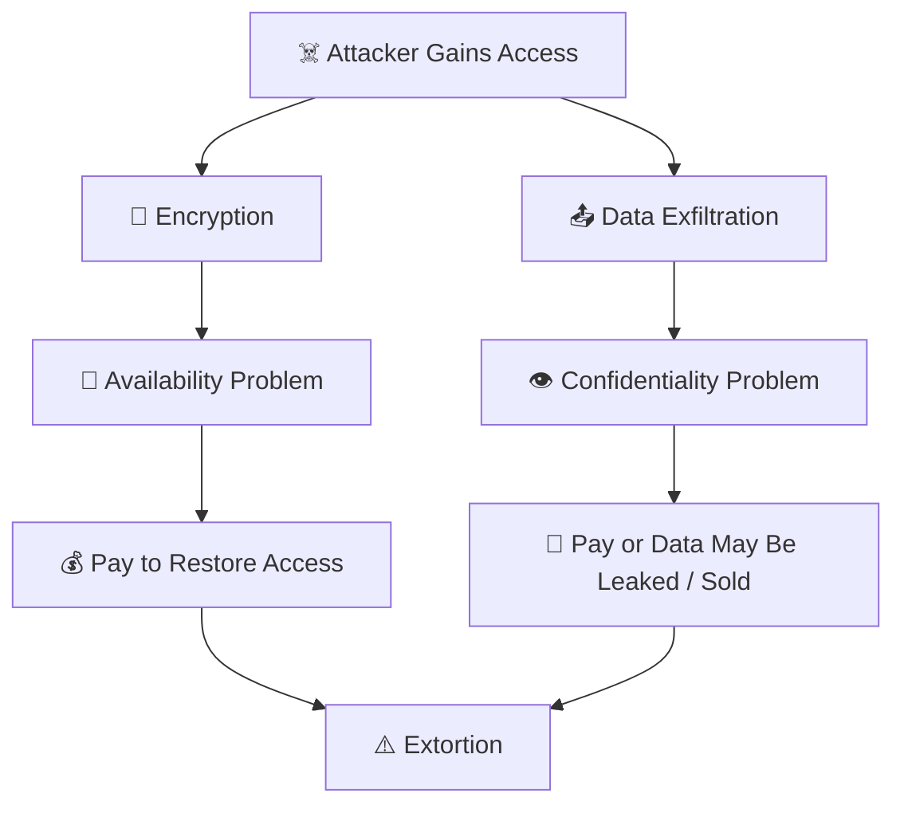

This helped me understand that ransomware can affect more than one security property.

The organisation may lose:

* 🚫 access to systems,
* 🔒 confidentiality of customer information,
* 💰 money,
* 🏢 business operations,
* 🤝 customer trust.

---

# 14 — 💾 Backup ≠ Complete Incident Resolution

I was given this scenario:

An attacker:

1. 📤 steals five million customer records,
2. 🔐 encrypts the live systems,
3. 💰 demands money.

The bank restores everything from backup within two hours.

Is everything solved?

**No.**

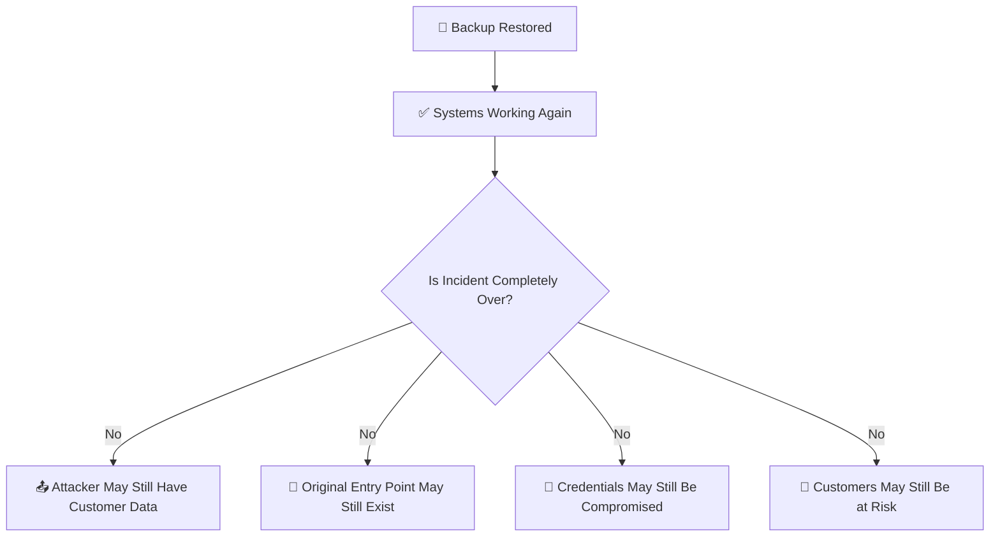

This is where I understood:

> **Recovery is not the same as complete incident resolution.**

The backup may solve one part:

### ✅ Availability

But not necessarily:

### ❌ Confidentiality

### ❌ Root cause

### ❌ Customer impact

### ❌ Regulatory responsibility

---

# 15 — 🤔 The Question I Asked My Mentor

I asked:

> "If the organisation pays the attacker, how do we know the attacker will actually give the key?"

And another question followed:

> "Even if they give the key, how do we know they deleted the stolen customer data?"

There is no automatic guarantee.

The attacker could:

* ❌ provide no key,
* 🔑 provide a key that does not work properly,
* 📤 keep stolen information,
* 💰 sell the information,
* 🔁 attempt another attack later.

So ransomware is not:

```text
Pay Money
   ↓
Everything Fixed
```

The attacker is not a normal trustworthy service provider.

That is an important limitation in the situation.

---

# 16 — 🏢 Organisational Responsibility

The bank example also made me think about something beyond the hacker.

If an organisation stores customer information, it has responsibilities around that information.

Suppose the technical systems are restored.

That still does not automatically remove:

* 👥 customer impact,
* 🔍 investigation,
* 🛡️ remediation,
* 📢 possible breach notifications,
* ⚖️ regulatory obligations,
* 📹 evidence preservation,
* 🚪 fixing the original attack path.

### My current mental model

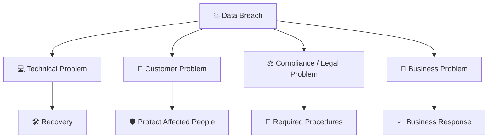

So cybersecurity incidents can become much bigger than:

> "Fix the computer."

---

# 17 — ⚖️ DPDP and Section 43A — My Correction

I initially understood:

```text
DPDP = Section 43A
```

That was incorrect.

**Section 43A** belonged to the Information Technology Act framework.

The **Digital Personal Data Protection Act, 2023** is separate legislation.

So:

```text
IT Act
  ↓
Section 43A
```

is not the same thing as:

```text
Digital Personal Data Protection Act, 2023
```

I am not trying to memorise the complete DPDP Act yet.

At my current level, the important concept is:

> **When organisations collect and process personal data, protecting that information is part of their responsibility.**

---

# 18 — 💰 My Ransom vs Fine Assumption

At first I thought about the bank example roughly like:

```text
Possible Large Fine
       VS
Smaller Ransom

Company chooses smaller ransom
```

After discussing it further, I understood that this is too simple.

A ransomware decision may involve:

* ⚖️ legal considerations,
* 🛡️ incident response,
* 👮 law-enforcement involvement,
* 📤 stolen information,
* 🔑 uncertainty about receiving a working key,
* 🏢 business impact,
* 👥 customer impact,
* 🚫 other restrictions or obligations.

So:

> **A smaller ransom does not automatically mean paying is the correct solution.**

---

# 19 — 🧾 Source Code Tampering — Another Correction

I also heard about tampering with source code.

Initially this can sound like:

> "Changing source code is illegal."

But that is obviously too broad.

Developers change code every day.

The legal issue discussed in the IT Act is more specific and depends on the circumstances and requirements around maintaining particular computer source documents.

So:

```text
Authorized software development
        ≠
Illegal source-code tampering
```

Again, context matters.

---

# 20 — 👁️ RansomLook

My mentor also showed us **RansomLook**.

I was introduced to it as a reference for observing ransomware-related activity.

I did **not** conduct ransomware investigations with it.

I did **not** analyse ransomware groups professionally.

So the accurate portfolio statement is:

> **I was introduced to RansomLook as a ransomware intelligence reference during the classroom session.**

I think this distinction is important because:

```text
Saw a tool
   ≠
Professional experience using the tool
```

---

# 21 — 🔗 Connection to My Systems-First Cybersecurity Roadmap

My Linux/Bash roadmap is currently around:

**Level 8.1 — Process Observation / Process Management**

I temporarily paused it while adjusting to offline coaching.

It is **not abandoned**.

Today actually showed me where some of those foundations may eventually connect.

### 🐧 Linux / System side

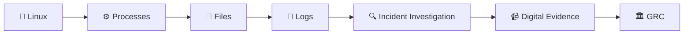

### 🌐 Networking side

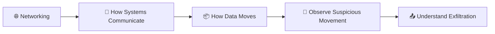

This showed me that GRC is **not replacing my technical roadmap**.

It is adding another layer:

> **Why technical activity matters to an organisation, its customers and sometimes an entire country's services.**

---

# 22 — 🔄 What I Thought vs What I Understand Now

| 🤔 Before                                       | 🧠 What I Understand Now                                                             |
| ----------------------------------------------- | ------------------------------------------------------------------------------------ |
| Restoring backup means ransomware is solved.    | Recovery may restore operations while stolen data and other risks remain.            |
| Siphoning means encryption.                     | ❌ No. Encryption transforms data; exfiltration moves/copies it out.                  |
| Exfiltration might mean decrypting information. | ❌ Decryption and exfiltration are completely different actions.                      |
| CCTV itself is enough evidence.                 | Source, integrity, system condition and proper procedure also matter.                |
| DPDP means Section 43A.                         | ❌ They are not the same legal provision/framework.                                   |
| Paying ransom means attackers return control.   | There is no guaranteed result.                                                       |
| Cybersecurity mostly protects computers.        | Cybersecurity can protect services that organisations and society depend upon.       |
| Backup solves every ransomware problem.         | Backup mainly helps recovery; it cannot retrieve data already stolen by an attacker. |

---

# 23 — 🧠 My Complete Day 2 Mental Model

This diagram represents the major connections I made today:

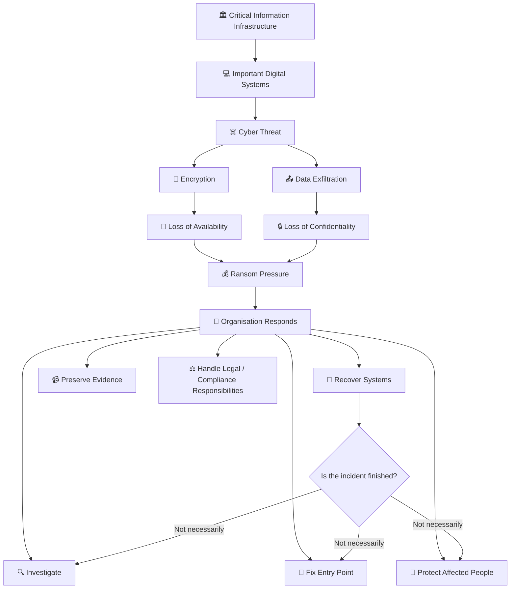

What I like about this diagram is that it does **not** end with:

```text
Backup restored
      ↓
Done ✅
```

Instead, it shows the complexity I understood:

> **Technical recovery is only one branch of the response.**

---

# 24 — 🚧 Limitations of My Current Understanding

I also want to be clear about what I **do not** know yet.

After Day 2, I am **not claiming** that I can:

* ❌ conduct ransomware incident response professionally,
* ❌ investigate ransomware groups,
* ❌ perform digital forensics,
* ❌ interpret Indian cyber law professionally,
* ❌ protect Critical Information Infrastructure,
* ❌ conduct threat intelligence investigations.

What I currently have is a **beginner mental model** connecting:

```text
🏛️ Critical Infrastructure
        ↓
☠️ Cyber Threats
        ↓
🔐 Encryption + 📤 Exfiltration
        ↓
💰 Ransomware / Extortion
        ↓
💾 Recovery + 🔍 Investigation
        ↓
📹 Evidence + ⚖️ Responsibility
```

That gives me something solid to build on.

---

# 25 — 🎯 My Day 2 Takeaways

> ### 🏛️ 1. Some systems are bigger than the computer itself.
>
> Their failure may affect essential services and large numbers of people.

> ### 🔐 2. Ransomware is not only about encryption.
>
> Attackers may also steal information and use it as additional leverage.

> ### 📤 3. Encryption and exfiltration are different.
>
> Encryption changes information. Exfiltration moves/copies information outside an authorised environment.

> ### 💾 4. Backup is important, but backup does not reverse data theft.
>
> Recovery does not automatically mean the complete incident is over.

> ### 📹 5. Electronic evidence requires integrity.
>
> Having a file is not the only question. Its origin, condition and handling matter.

> ### 🏢 6. A cyberattack can create more than a technical problem.
>
> Customer, business, regulatory and evidence-related responsibilities may remain.

> ### ⚖️ 7. I should verify legal references instead of blindly memorising section numbers.

> ### 🛡️ 8. Day 1 still applies.
>
> Even when I notice a serious vulnerability or critical system, technical capability does not expand my authorization.

---

# 🧠 Final Reflection

Day 1 taught me to ask:

> **"Am I authorized?"**

Day 2 made me start asking:

> **"What happens when the system is actually compromised?"**

At first, ransomware looked simple to me:

```text
Attacker encrypts data
        ↓
Company loses access
        ↓
Attacker asks for money
```

But after thinking through the bank example, my understanding became:

```text
Attacker gains access
        ↓
 ┌──────┴──────┐
 ↓             ↓
Encrypt      Steal Data
 ↓             ↓
No Access    Data Exfiltration
 └──────┬──────┘
        ↓
   Extortion
        ↓
Organisation Responds
        ↓
Recovery + Investigation + Evidence + Responsibility
```

That is the biggest difference in my thinking today.

A cybersecurity incident is not always one technical problem with one technical solution.

It can involve:

**systems + data + people + evidence + business + law + responsibility.**

I also made mistakes while learning:

* I mixed up siphoning and encryption.
* I did not initially understand exfiltration.
* I treated backup as though it could solve the entire ransomware incident.
* I mixed Section 43A with the DPDP framework.
* I treated Section 65B as though it were still the only current electronic-evidence provision.

I corrected those ideas instead of hiding them.

That is what I want this portfolio to show:

> **I am not documenting cybersecurity to pretend that I already know everything. I am documenting how I reason, where I make mistakes, how I verify them, and how my understanding becomes more accurate over time.**

---

## ✅ Day 2 Learning Status

```text
🛡️ SYSTEMS-FIRST CYBERSECURITY PORTFOLIO
│
├── 🐧 Linux / Bash
│      └── Level 8.1 — Process Observation
│             └── ⏸️ Temporarily paused — NOT abandoned
│
└── 🏛️ GRC Coaching
       │
       ├── ✅ Day 1
       │      └── Governance • Risk • Compliance
       │          Authorization • Scope
       │
       └── ✅ Day 2
              └── Critical Infrastructure
                  ↓
                  NCIIPC
                  ↓
                  Electronic Evidence
                  ↓
                  Ransomware
                  ↓
                  Encryption / Decryption
                  ↓
                  Data Exfiltration
                  ↓
                  Recovery & Organisational Responsibility
```

### 🚀 Next

Continue with **Day 3 coaching**, while keeping the **Systems-First Cybersecurity Roadmap** as a separate active learning track.

---

> ### 🛡️ Portfolio Principle
>
> **Document what I genuinely understand. Show the connections. Show the limitations. Show where I was wrong and how I corrected it. Never turn one classroom session into an exaggerated claim of expertise.**
