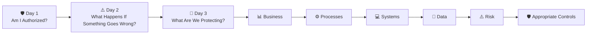
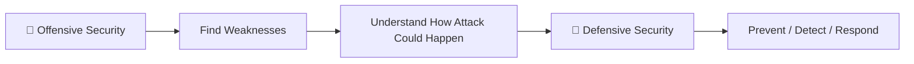
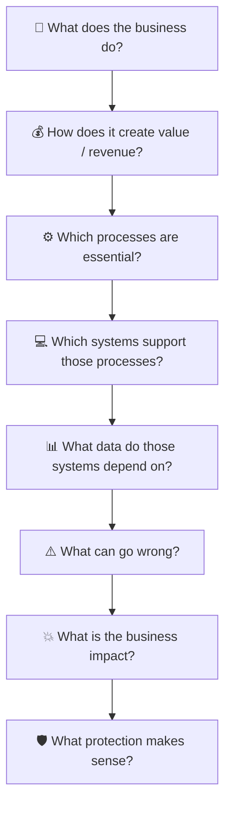
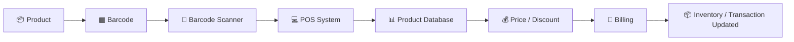
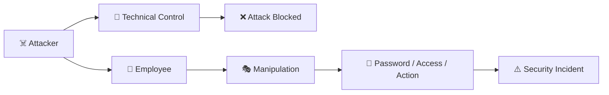
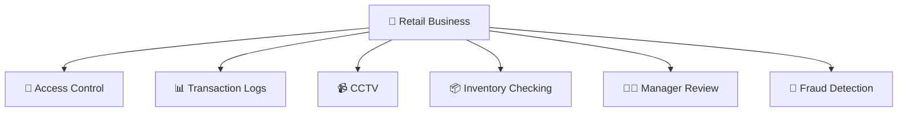
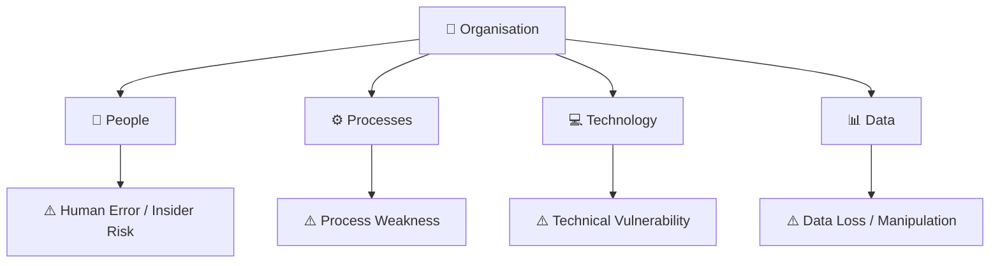
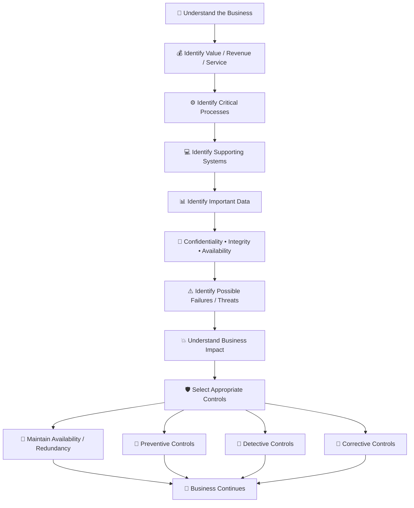
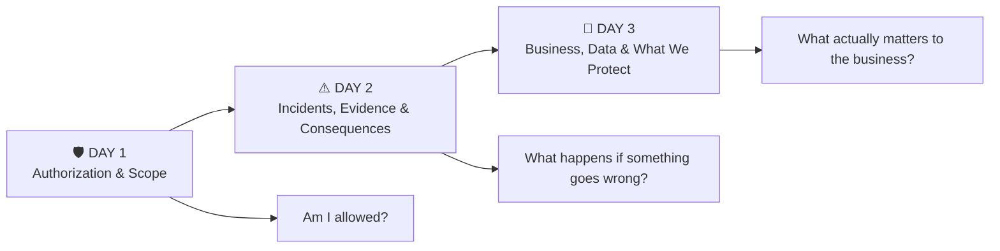

# 🛡️ GRC — DAY 03

## Before Securing a System, Understand What the Business Actually Needs Protected

**Learning Track:** Governance, Risk & Compliance
**Focus:** Security Foundations • Business Context • Assets • Data • CIA Triad • POS Systems • Risk • Controls • Human Risk • Defense in Depth

---

> [!IMPORTANT]
>
> ### 💡 The one idea I am taking from Day 3
>
> **Cybersecurity should not begin with a tool. It should begin with understanding the business and identifying what is actually valuable to it.**
>
> Before deciding how much security an organisation needs, I should ask:
>
> **What does this business do? What keeps it running? What data does it depend on? What happens if something fails or is manipulated? How much protection is justified by that risk?**

---

# 📍 Where Day 3 Continued From My Previous GRC Learning

My first two GRC sessions changed how I looked at cybersecurity.

### 🛡️ Day 1

My main question became:

> **Am I authorized to do this?**

Technical capability does not automatically mean permission.

### ⚠️ Day 2

I moved toward:

> **What happens when an important system or information is compromised?**

I learned about critical infrastructure, electronic evidence, ransomware, data exfiltration and organisational responsibility.

### 🏢 Day 3

Today's session introduced another question:

> **What exactly are we trying to protect?**



This helped me understand that cybersecurity is not separate from the business.

Security exists because something valuable needs protection.

---

# 01 — 🔴 Offensive Security and 🔵 Defensive Security

At the beginning of today's session, I was introduced again to the basic security foundations.

## 🔴 Offensive Security

Offensive security looks at systems from an attacker's perspective.

The purpose is to identify weaknesses before a malicious attacker takes advantage of them.

Examples may include:

* vulnerability assessment,
* penetration testing,
* security testing,
* identifying weak configurations,
* testing whether security controls can be bypassed.

The important connection to my Day 1 lesson is that offensive activities must still remain inside an **authorized scope**.

```text
I know how to test something
          ≠
I have permission to test it
```

---

## 🔵 Defensive Security

Defensive security focuses on protecting systems and organisations.

This can include:

* preventing attacks,
* detecting suspicious activity,
* monitoring systems,
* controlling access,
* responding to incidents,
* recovering from failures.

So I currently understand the relationship as:



But today's class made me realise that both offensive and defensive security still depend on another question:

> **What is important enough to protect in the first place?**

---

# 02 — 🔺 CIA Triad

Another security foundation discussed today was the **CIA Triad**.

CIA stands for:

* **Confidentiality**
* **Integrity**
* **Availability**

I do not want to remember them only as definitions.

I want to connect them to actual business situations.

---

## 🔒 Confidentiality

Confidentiality asks:

> **Who should be allowed to see this information?**

For example, a retail employee may need to see the price of a product.

That does not necessarily mean the same employee should have access to:

* the complete customer database,
* employee salaries,
* administrator passwords,
* financial reports,
* confidential business information.

So:

```text
Having access to one function
            ≠
Having access to everything
```

---

## ✅ Integrity

Integrity asks:

> **Is the information still correct and trustworthy?**

Suppose a product originally costs:

```text
₹400
```

But someone changes the database value to:

```text
₹40
```

The system may still be online.

The scanner may still work.

The POS terminal may still respond.

But the information is now incorrect.

The business can lose money even though nothing technically "crashed."

That helped me understand integrity much better.

---

## ⏱️ Availability

Availability asks:

> **Can the system or information be used when the business needs it?**

For example, if a store's billing system becomes unavailable for several hours:

```text
POS unavailable
      ↓
Customers cannot complete purchases
      ↓
Queues increase
      ↓
Customers may leave
      ↓
Sales are lost
      ↓
Business impact
```

So availability is not simply:

> "Is the computer switched on?"

It is:

> **Can the required business service continue functioning when it is needed?**

---

# 03 — 🏪 The D-Mart Example: Start With the Business

My mentor did not begin today's lesson by immediately giving definitions.

Instead, he gave us a business example using a retail organisation such as **D-Mart**.

The first question was not:

> "Which cybersecurity software should D-Mart buy?"

The first question was:

> **What actually allows this business to operate and generate revenue?**

This completely changes the way I think about security.

A retail store depends on many things such as:

* 👥 employees,
* 🧾 billing systems,
* 🔫 barcode scanners,
* 💻 computers,
* 💳 payment systems,
* 📱 UPI transactions,
* 🖨️ receipt printers,
* 📊 product and price information,
* 💾 databases,
* 🌐 network connectivity,
* ⚡ electricity,
* 📦 inventory systems,
* 🛠️ maintenance and technical support.

These things are not equally important.

The important question is:

> **What happens to the business if one of them fails?**

---

# 04 — 💻 The Term I Forgot: POS System

The official term I was trying to remember from class was most likely:

# **POS — Point of Sale**

A **Point of Sale system** is the system used to complete a customer's purchase.

A POS environment can contain:

```text
🖥️ Billing computer
      +
🔫 Barcode scanner
      +
🧾 POS software
      +
💳 Card / payment terminal
      +
🖨️ Receipt printer
      +
📊 Product / price database
      +
📦 Inventory connection
```

So when I see the checkout computer in a supermarket, it is not simply "a computer."

It is supporting an important **business process**:

> **Completing a sale.**

---

# 05 — 💰 Business Process Before Cybersecurity Tool

This was probably the most important change in my thinking today.

Imagine I walk into a company and immediately say:

> "You need a firewall."

That is not enough.

Before recommending protection, I first need to understand:



The security solution should follow the business requirement.

Not the other way around.

---

# 06 — 📊 What Is Data?

Today's class mainly focused on **data**.

My mentor described data as facts or events that are collected or recorded.

My current understanding is:

> **Data is a raw fact, observation, measurement or recorded value that can later be stored, processed or analysed.**

Examples include:

```text
📞 Number of calls received = 83

⏱️ Call duration = 4 minutes 26 seconds

🌐 Internet unavailable = 17 minutes

💾 Memory available = 8 GB

⛽ Fuel refill = 32 litres

💳 Payment method = UPI

📦 Product ID = 10842

💰 Product price = ₹400

🏪 Store ID = HYD-04
```

Something does not necessarily have to be an event to qualify as data.

A value such as:

```text
Employee ID = 5521
```

is also data.

---

# 07 — 🗄️ Data vs Database

I also corrected one part of my original mental model.

I initially thought:

> **Database = server where data is stored**

That is useful as a beginner picture, but technically they are different.

## Database

A **database** is an organised collection of data that can be stored, searched, retrieved and updated.

## DBMS

A **Database Management System — DBMS** is software that manages the database.

Examples include:

* PostgreSQL
* MySQL
* Microsoft SQL Server
* Oracle Database

## Server

A server is a computer or computing environment that may run the DBMS and provide database services to other systems.

So a better mental model is:

```text
🖥️ SERVER
     │
     ▼
⚙️ Database Management System
     │
     ▼
🗄️ DATABASE
     │
     ├── Products
     ├── Prices
     ├── Inventory
     ├── Sales
     └── Transactions
```

---

# 08 — 🔫 How Product Scanning Connects to Data

Suppose a customer brings a product to the checkout counter.

The product normally contains a **barcode**.

The process may roughly look like this:



For example:

```text
Product ID: 72819

Normal price: ₹400

Discount: 20%

Final price: ₹320
```

The POS system depends on the stored data being correct.

If the data is wrong, the billing can also become wrong.

That is why the database is not just an IT component.

It supports a real business process.

---

# 09 — ⚠️ From Asset to Risk

After identifying what keeps the business running, the next question becomes:

> **What can go wrong?**

This is where risk thinking begins.

For example:

```text
Barcode scanner fails
        ↓
Counter cannot scan normally
        ↓
Checkout becomes slower
        ↓
Long queues
        ↓
Customers may leave
        ↓
Revenue may be lost
```

Instead of allowing one scanner failure to stop the business, the organisation could keep another scanner available.

That leads to another important concept:

# **Control**

A control is something used to reduce risk.

Examples:

| ⚠️ Risk                     | 🛡️ Possible Control         |
| --------------------------- | ---------------------------- |
| Scanner failure             | Spare scanner                |
| Employee absence            | Backup staff                 |
| Power outage                | UPS / generator              |
| Data loss                   | Backup                       |
| Unauthorized account access | Access control / MFA         |
| System vulnerability        | Patching                     |
| Network attack              | Firewall / monitoring        |
| Software problem            | Maintenance/support          |
| Fraud                       | Logs / reconciliation / CCTV |

---

# 10 — 🔁 Redundancy

The example of having several counters introduced me to another useful concept:

# **Redundancy**

Redundancy means having additional resources so that one failure does not stop the complete service.

Suppose the store needs at least four working counters.

```text
Available counters = 7

Counter 2 fails ❌
Counter 6 fails ❌

Still available = 5 ✅
```

The business can continue operating.

This strongly connects to the **Availability** part of the CIA triad.

---

# 11 — 📉 Downtime Has a Business Cost

One system being unavailable for a few minutes may not always be serious.

But if a critical billing or payment service is unavailable for several hours, the organisation can lose significant revenue.

This taught me that a GRC/security person should not stop at:

> "The system failed."

I should ask:

```text
How long was it unavailable?

How many customers were affected?

Which business process stopped?

How much revenue was lost?

Was another method available?

How quickly can the organisation recover?
```

So technical failure eventually becomes **business impact**.

---

# 12 — 🌐 One Branch vs Many Branches

The D-Mart example became more interesting when thinking about scale.

Imagine a small local store with:

```text
1 branch
↓
few systems
↓
local POS
↓
limited connections
```

It may still require security.

But the amount and complexity of security may be very different from a nationwide organisation.

Now imagine:

```text
Branch 1 ─┐
Branch 2 ─┤
Branch 3 ─┤
Branch 4 ─┼──► 🌐 Network ───► 🗄️ Central Systems
Branch 5 ─┤
   ...    │
Branch N ─┘
```

Now many systems and locations depend on shared infrastructure.

An issue affecting a central service may affect many branches.

Therefore the potential impact becomes much greater.

---

# 13 — ⚠️ Correction: No Internet Does Not Mean No Cybersecurity

One thought I initially had was:

> "If everything is local and there is no Internet connection, maybe cybersecurity is not required."

I corrected this after thinking deeper.

```text
No Internet
     ≠
No Security Risk
```

Even an isolated system can face:

* malicious USB devices,
* malware,
* unauthorized physical access,
* employee misuse,
* stolen credentials,
* accidental deletion,
* unauthorized changes,
* misconfiguration,
* data theft.

Internet connectivity increases the number of possible attack paths, but removing Internet access does not remove all cybersecurity risk.

A better conclusion is:

> **Security should be proportional to the environment and risk.**

---

# 14 — 💵 Security Should Match the Risk

A very small store probably does not need its own massive 24×7 Security Operations Centre.

It may use controls such as:

```text
Firewall
+
Endpoint protection
+
Backups
+
Access control
+
Patching
+
Vendor support
```

A large organisation with:

* hundreds of branches,
* central databases,
* thousands of employees,
* customer information,
* payment systems,
* large networks,

may require much more sophisticated security.

For example:

```text
SOC
+
SIEM
+
Identity & Access Management
+
Security Monitoring
+
Incident Response
+
Network Security
+
Governance
+
Risk Management
+
Compliance
+
Business Continuity
```

The lesson is not:

> **More security is always better.**

The better question is:

> **What level of security is justified by the risk and business impact?**

---

# 15 — 🎭 If Technology Is Difficult to Attack, Attackers May Target People

Another important part of today's discussion was that security risk is not always purely technical.

An organisation may have strong systems, but people and processes can still be manipulated.

This connects to:

# **Social Engineering**

Social engineering involves manipulating people into performing an action or revealing information.

For example:



This made me realise that cybersecurity is not simply:

```text
Computer vs Hacker
```

It can involve:

```text
People
+
Processes
+
Technology
+
Data
```

---

# 16 — 🧠 My Own Investigation Framework

While thinking about the examples from class, I developed my own simple investigation questions.

Initially I thought about:

```text
👤 Person
⏰ Time
📍 Place
📊 Data
```

These are useful, but I should not treat them as the only four ways security can be manipulated.

A more complete investigation mindset would be:

```text
👤 WHO was involved?

📊 WHAT happened or changed?

⏰ WHEN did it happen?

📍 WHERE did it happen?

⚙️ HOW did it happen?

💻 WHICH system/device/account was involved?

🔑 WHAT access was used?

🛡️ WHY did the existing control fail?
```

I want to continue developing this reasoning as I learn more about incidents and investigations.

---

# 17 — 🛒 Retail Fraud Case Study From Class

My mentor gave us a retail fraud example.

The exact number of products is less important to me than the security lesson.

The situation was roughly:

```text
Customer has several products
          ↓
Employee appears to process them
          ↓
Only some items are actually recorded
          ↓
Customer leaves with more items than were billed
          ↓
Inventory / money does not match
          ↓
Business suffers loss
```

An important point is that the POS system itself may not have been technically hacked.

The person with legitimate access may have misused the business process.

This introduces:

# **Insider Threat**

An insider threat is risk involving someone who already has legitimate access to an organisation.

Insider risk can be:

* malicious,
* accidental,
* negligent,
* or caused by compromised employee credentials.

So:

```text
Valid access
      ≠
Valid behaviour
```

---

# 18 — 📹 CCTV as Another Security Control

In the class case study, CCTV helped verify what was happening.

This showed me why organisations use more than one type of control.

The transaction system recorded one thing.

CCTV provided another source of evidence.

This also connects directly to my Day 2 learning about electronic evidence.

The important security concept here is:

# **Detective Control**

Controls can serve different purposes.

### 🛑 Preventive Controls

Designed to prevent an unwanted event.

Examples:

* access control,
* MFA,
* door locks,
* firewall rules.

### 🔎 Detective Controls

Designed to identify suspicious or unwanted activity.

Examples:

* CCTV,
* logs,
* monitoring,
* transaction alerts,
* SIEM detections.

### 🔧 Corrective Controls

Designed to recover or correct problems after they occur.

Examples:

* backups,
* incident response,
* restoring systems,
* replacing compromised devices.

So CCTV may not necessarily prevent fraud.

But it may help detect, investigate and prove what happened.

---

# 19 — 🧅 Defense in Depth

This case also helped me understand why a company should not rely on one security mechanism.

This is called:

# **Defense in Depth**

Defense in depth means using multiple layers of protection.

For example:



If one mechanism fails, another may detect or reduce the damage.

---

# 20 — 🔄 Reconciliation

The retail example also introduced an idea that I found interesting.

Suppose:

```text
POS system:
100 items sold
```

But actual inventory shows:

```text
110 items missing
```

There is a mismatch.

Comparing independent records to identify differences is broadly known as:

# **Reconciliation**

For example:

```text
Sales records
       ↕
Inventory records
       ↕
Payment records
       ↕
Logs / CCTV
```

Security can sometimes involve checking whether different sources of information agree with each other.

It is not always about blocking a hacker.

---

# 21 — ⚡ Smart Meter Example

Another example discussed in class involved electricity meters.

Traditionally, some processes depend more heavily on manual human activity.

A person may:

```text
Visit location
      ↓
Read meter
      ↓
Record value
      ↓
Enter billing information
```

Possible problems include:

* incorrect reading,
* incorrect entry,
* delay,
* manipulation,
* human error.

A smart meter can automate part of that process:

```text
⚡ Smart Meter
      ↓
🌐 Communication
      ↓
🖥️ Backend System
      ↓
🧾 Billing
      ↓
📱 Customer
```

Automation may remove some manual risks.

But it can introduce other risks such as:

* device compromise,
* software vulnerabilities,
* communication/network attacks,
* unauthorized access,
* incorrect configuration,
* data integrity problems.

So one lesson I took from this example is:

> **Automation does not eliminate risk. It changes the type of risk that needs to be managed.**

---

# 22 — 👥 People, Process and Technology

Today's examples showed me that cybersecurity cannot focus only on machines.

An organisation depends on:



A strong firewall cannot fix every weak business process.

A secure application cannot completely prevent an authorized employee from deliberately abusing permissions.

That is why understanding the full environment matters.

---

# 23 — 💼 How My Mentor Wants Me to Think in a Cybersecurity Career

One of the most career-relevant lessons from today's class was about interviews and professional thinking.

My mentor said that I should not approach cybersecurity only by saying:

> "I know this tool."

> "I know how to scan."

> "I can identify vulnerabilities."

Those abilities are useful.

But before working on a security problem, I should understand the client.

For example:

### 🏦 Banking

Important concerns may include:

* transactions,
* customer accounts,
* financial information,
* fraud,
* availability,
* access control.

### 🏥 Healthcare

Important concerns may include:

* patient information,
* medical systems,
* privacy,
* availability,
* patient safety.

### 🏪 Retail

Important concerns may include:

* POS,
* payments,
* inventory,
* product information,
* supply chain,
* customer information.

### 🏭 Manufacturing

Important concerns may include:

* production systems,
* operational technology,
* equipment availability,
* intellectual property,
* supply chain.

The security priorities can change depending on the business.

---

# 24 — 🎯 Questions I Should Learn to Ask

Instead of beginning with:

> "Which tool should I use?"

I should start asking:

```text
🏢 Who is my client?

💰 How does this organisation make money or provide its service?

⚙️ Which business processes are essential?

📊 What data is important?

💻 Which systems depend on that data?

👥 Who needs access?

⚠️ What could go wrong?

💥 What would happen if it went wrong?

⏱️ How long can the business tolerate the failure?

🛡️ What controls already exist?

💵 How much security is reasonable for this risk?
```

This feels much closer to professional cybersecurity thinking than simply memorising tools.

---

# 25 — 🔗 My Complete Day 3 Mental Model



---

# 26 — 🧠 New Terminology I Learned / Connected Today

| Term                   | My Current Understanding                                               |
| ---------------------- | ---------------------------------------------------------------------- |
| **Asset**              | Something valuable to the organisation                                 |
| **Business Process**   | A set of activities needed to deliver a business function              |
| **POS**                | Point of Sale system used to complete retail purchases                 |
| **Data**               | Raw facts, observations, measurements or recorded values               |
| **Database**           | Organised collection of data                                           |
| **DBMS**               | Software used to manage databases                                      |
| **Confidentiality**    | Keeping information accessible only to appropriate people              |
| **Integrity**          | Keeping information correct and preventing unauthorized modification   |
| **Availability**       | Keeping systems/services usable when required                          |
| **Risk**               | Possibility of something causing unwanted business impact              |
| **Control**            | Measure used to reduce risk                                            |
| **Redundancy**         | Additional resources that allow operations to continue after a failure |
| **Social Engineering** | Manipulating people instead of directly attacking technology           |
| **Insider Threat**     | Risk involving someone with legitimate organisational access           |
| **Preventive Control** | Control designed to stop an event                                      |
| **Detective Control**  | Control designed to identify an event                                  |
| **Corrective Control** | Control designed to recover or correct an event                        |
| **Defense in Depth**   | Using several security layers instead of relying on one control        |
| **Reconciliation**     | Comparing records/sources to detect differences                        |
| **Business Impact**    | Effect a disruption or incident has on the organisation                |

---

# 27 — ⚠️ Things I Corrected in My Own Understanding

Today's discussion also helped me catch a few assumptions.

### ❌ Assumption 1

> "No Internet means no cybersecurity is required."

### ✅ Correction

Offline or local systems can still face malware, physical access, insider misuse, unauthorized changes and other risks.

---

### ❌ Assumption 2

> "A database is simply a server."

### ✅ Correction

A database is the organised data collection. A server may host software that manages and provides access to that database.

---

### ❌ Assumption 3

> "Every security problem must involve a technical hack."

### ✅ Correction

People, processes, legitimate accounts, fraud, mistakes and insider misuse can also create security incidents.

---

### ❌ Assumption 4

> "Automation removes risk."

### ✅ Correction

Automation may reduce certain human risks while introducing new technology, network, device and software risks.

---

# 28 — 💡 The Biggest Change in My Thinking

Before today's session, cybersecurity could easily look like:

```text
Learn tool
    ↓
Scan system
    ↓
Find vulnerability
    ↓
Fix vulnerability
```

Now I see another layer before all of that:

```text
Understand business
        ↓
Understand what is valuable
        ↓
Understand the process
        ↓
Understand the data
        ↓
Understand the risk
        ↓
Understand the impact
        ↓
Then decide what security is needed
```

This feels like the difference between simply learning cybersecurity tools and beginning to think like someone responsible for organisational security.

---

# 🎯 Day 3 Final Takeaway

> **I cannot protect something properly if I do not understand why it matters.**
>
> Cybersecurity begins by understanding the organisation, its business processes, its people, its systems and its data.
>
> Only after understanding what the organisation depends on can I meaningfully identify risks and decide what controls are appropriate.

---

# 🔗 My GRC Learning Journey So Far



### My three current questions

```text
DAY 1 → Am I authorized?

DAY 2 → What happens when something is compromised?

DAY 3 → What are we protecting, and why does it matter?
```

The next part of my learning will continue into **information and access**, but I am intentionally stopping today's documentation here because those topics were not fully covered in this session.

---

## 🧭 Current GRC Mindset

```text
Do not start with the tool.

Start with the business.

Understand the process.

Identify the data.

Understand the risk.

Measure the impact.

Then decide how to protect it.
```
