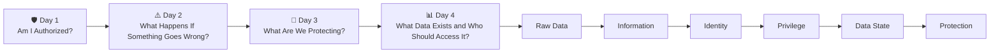
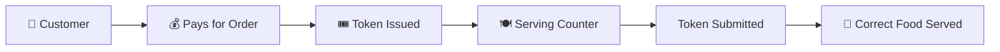
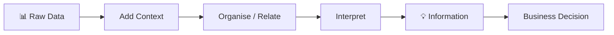
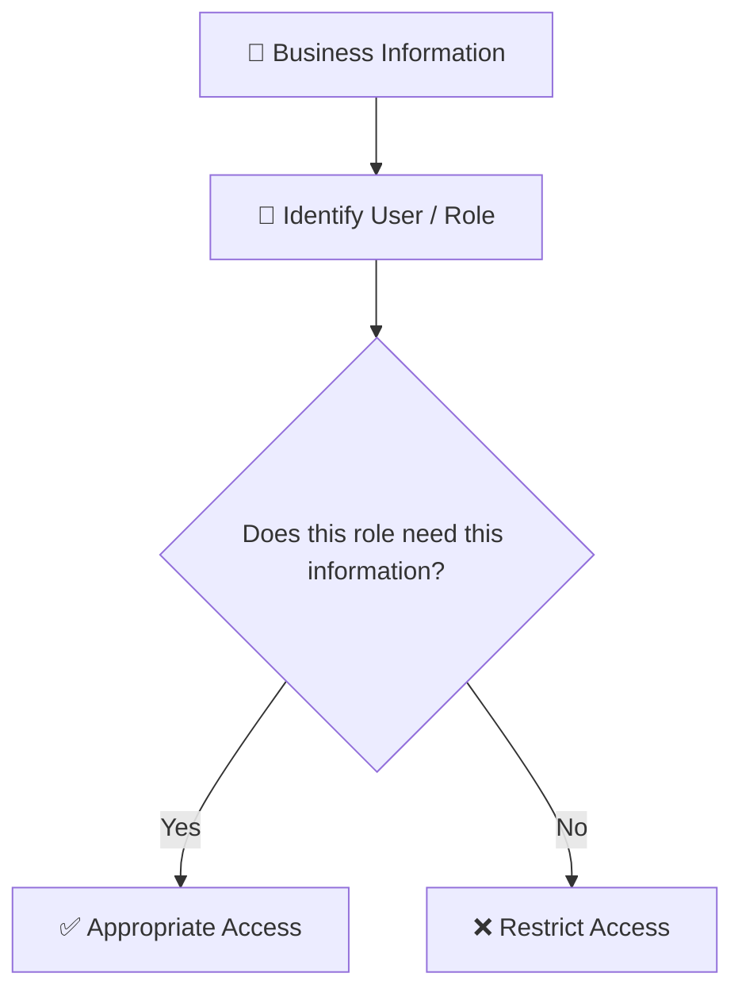
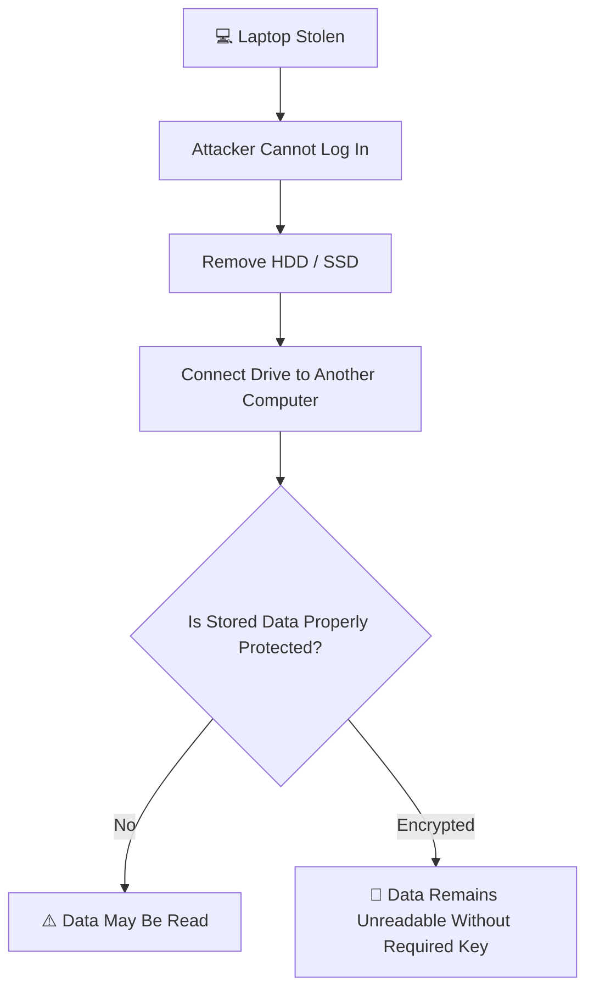
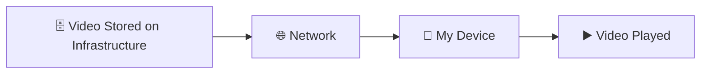
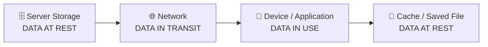
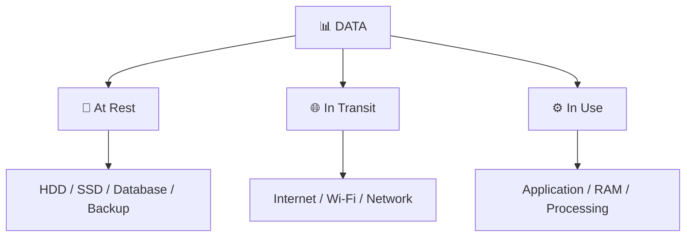
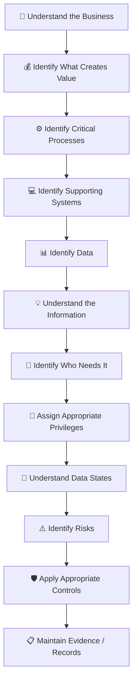
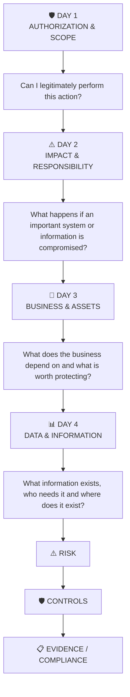

# 🛡️ GRC — DAY 04

## From Raw Data to Protected Information

**Learning Track:** Governance, Risk & Compliance
**Focus:** Data • Information • Business Records • Identity • Privilege • Least Privilege • Data at Rest • Data in Transit • Encryption • BitLocker • Logs • Mobile Security

---

> [!IMPORTANT]
>
> ### 💡 The one idea I am taking from Day 4
>
> **A business cannot protect information properly until it understands what data it collects, why it collects it, who needs access to it, where it exists, and how it moves.**
>
> Security is not simply:
>
> **“Protect the computer.”**
>
> I now want to ask:
>
> **What data exists? What meaning does it create? Who needs it? Where is it stored? Where does it travel? What happens if somebody reads, changes, steals or loses it?**

---

# 📍 Where Day 4 Continued From My Previous GRC Learning

My GRC learning is slowly forming a chain.

### 🛡️ Day 1

My main question became:

> **Am I authorized to do this?**

Technical capability does not automatically mean permission.

---

### ⚠️ Day 2

I started thinking about:

> **What happens when important systems or information are compromised?**

This introduced me to critical systems, cyber incidents, electronic evidence, organisational responsibility and the consequences of security failures.

---

### 🏢 Day 3

The question changed to:

> **What exactly are we protecting?**

I learned to begin with the business:

```text
Business
   ↓
Value / Revenue
   ↓
Critical Processes
   ↓
Supporting Systems
   ↓
Assets
   ↓
Data
   ↓
Risk
   ↓
Business Impact
   ↓
Appropriate Security Controls
```

---

### 📊 Day 4

Today's session moved deeper into one of those assets:

> **DATA**



This helped me realise that cybersecurity is not only about systems.

A large part of cybersecurity exists because those systems **create, process, store and transmit information that has value to the business.**

---

# 01 — 📊 What Is Data?

At first, the word **data** sounds very technical.

I used to immediately imagine:

* databases,
* Excel files,
* customer records,
* servers,
* logs,
* large amounts of digital information.

But today's discussion made the idea much simpler.

> **Data can be any recorded fact, value, observation or event that can later be used.**

For example:

```text
₹40
Dosa
10:30 AM
Customer 14
Table 6
Payment Successful
```

Individually, these are pieces of data.

Even very small things can become useful data if the business has a reason to record them.

For example:

* how many customers entered,
* what product was ordered,
* what time an order was placed,
* how much money was paid,
* which employee handled a transaction,
* whether a payment succeeded,
* which machine processed the order,
* when somebody logged into a system.

The value often appears when these individual observations are collected and connected.

---

# 02 — 🥘 The Restaurant Example That Made Data Practical

My mentor explained data using a very simple local-business example.

Imagine a small restaurant.

A customer walks in and asks:

> “How much is a dosa?”

The employee verbally replies:

> “₹40.”

The customer pays ₹40.

The employee prepares or serves the dosa.

If nothing is recorded, the transaction may exist only in the memory of the employee and customer.

Now imagine four customers purchased food during the day.

Later the real owner asks the employee:

> “How many customers came today?”

The employee says:

> “Two.”

How does the owner know whether that statement is correct?

There may be no reliable record.

```text
Customer
   ↓
Pays employee
   ↓
Employee remembers transaction
   ↓
Food served
   ↓
No reliable record
```

This creates a problem.

The owner is depending almost completely on what another person tells him.

That makes manipulation easier.

---

# 03 — 🎟️ Why a Token Changes the Situation

Now imagine the restaurant introduces a token system.

The flow becomes:



Suppose:

```text
Token 101 = Dosa
Token 102 = Idli
Token 103 = Dosa
Token 104 = Dosa
```

If I hold a token representing a dosa and tell the serving employee:

> “I ordered idli.”

the employee does not have to depend only on what I say.

The token provides a record representing the order.

```text
What customer says
        ↓
      Compare
        ↕
What token represents
```

This reduces dependence on memory or verbal claims.

---

# 04 — 🔎 The Token Is Also an Audit Trail

What interested me more was what happens at the end of the day.

The business can compare:

```text
Tokens Issued
      ↕
Payments Received
      ↕
Orders Served
```

For example:

```text
100 tokens issued
       ↓
100 orders should exist
       ↓
Expected money should roughly match those orders
```

But imagine:

```text
100 tokens issued

80 transactions recorded
```

Now there is something that requires investigation.

This introduced me naturally to several GRC/security ideas.

### 🧾 Audit Trail

A record that helps reconstruct what happened.

### 🔄 Reconciliation

Comparing different records to check whether they agree.

### ✅ Integrity

Checking whether information remains complete, correct and trustworthy.

### 👤 Accountability

Being able to associate actions with the responsible person, system or process.

### 🚨 Fraud Detection

Records can make unusual differences easier to identify.

So the token is not simply a piece of paper.

It participates in a **business control**.

---

# 05 — 🧠 Raw Data vs Information

Another important distinction from today was:

> **Data and information are related, but they are not exactly the same thing.**

Suppose I write:

```text
30
Dosa
40
3
Idli
10:45
50
```

These are data points.

But without context, I may not know what they mean.

Now imagine I arrange them like this:

| Time     | Order | Quantity | Price |
| -------- | ----- | -------: | ----: |
| 10:30 AM | Idli  |        1 |   ₹30 |
| 10:35 AM | Dosa  |        1 |   ₹40 |
| 10:45 AM | Dosa  |        2 |   ₹80 |

Now the values communicate something useful.

I can understand:

* what was ordered,
* when it was ordered,
* how many were ordered,
* how much the transaction was worth.

My current mental model is:



So the simplest way I remember it is:

> **Data = recorded facts.**

> **Information = meaning obtained from data in context.**

---

# 06 — ⚠️ Structured Data Is Not Automatically Information

One technical point I want to remember is that simply putting data into rows and columns does not magically make it valuable information.

For example:

```text
Column A | Column B
30       | ABC
40       | XYZ
```

This is structured.

But if nobody knows what the columns represent, it may still provide almost no useful meaning.

At the same time, something does not have to be inside a database to contain information.

For example:

> “Customer reported that the payment failed twice at 10:30 AM.”

That is normal text, but it contains useful information.

Therefore:

```text
Structure helps organise data
            ↓
Context gives data meaning
            ↓
Meaning makes it useful as information
```

---

# 07 — 🏢 Why Data Matters to a Business

Today's lesson connects directly with Day 3.

A business process continuously produces data.

For example, a retail business may produce:

```text
Customer
   ↓
Purchase
   ↓
Transaction Data
   ↓
Payment Data
   ↓
Inventory Update
   ↓
Sales Record
   ↓
Financial Information
   ↓
Business Decision
```

A manager may use this information to answer questions such as:

* Which product sells the most?
* Which location generates more revenue?
* How much inventory remains?
* How many customers visited?
* Which hours are busiest?
* Did sales increase or decrease?
* Are recorded sales matching money received?

So data is not collected only because:

> “Computers need data.”

The business should ideally have a purpose for collecting and using it.

---

# 08 — 👤 Identity: Who Is Trying to Access the Information?

Once information exists, another question immediately appears:

> **Who should be able to access it?**

This connects data protection with **identity**.

An identity represents a person, account, application, device or other entity interacting with a system.

For a simple hotel example, different identities may include:

```text
Guest
Receptionist
Manager
Finance Employee
System Administrator
Hotel Owner
Application
Payment System
```

They do not automatically need the same access.

---

# 09 — 🔐 What Does Privilege Mean?

The word **privileged** can sound like:

> “This person is powerful or important.”

That is not the way I want to remember it in information security.

A **privilege** is permission to perform a particular action or access a particular resource.

For example:

```text
Hotel Guest
├── View own reservation ✅
├── View own bill ✅
├── Request hotel services ✅
├── View another guest's personal details ❌
├── View employee salaries ❌
└── View complete hotel revenue reports ❌
```

The customer has legitimate access.

But that access has limits.

---

# 10 — 🏨 The Hotel Example

Suppose I book a room in a hotel.

The hotel needs to provide me with certain information.

For example:

* my room number,
* my booking,
* my bill,
* services available to me,
* charges made to my stay.

But imagine I walk to the hotel's computer and start checking:

* complete hotel revenue,
* company debts,
* employee salary information,
* other customers' bills,
* business corrections made that day.

The first question is:

> **Do I need this information to stay at the hotel?**

No.

Therefore, legitimate access to one part of the organisation does not give me legitimate access to everything.

```text
I am a legitimate customer
           ≠
I can access every hotel record
```

---

# 11 — 👔 Different Roles Need Different Access

Now consider hotel employees.

A receptionist may need:

```text
Reservations ✅
Room availability ✅
Guest check-in information ✅
Billing-related information ✅
```

But that does not necessarily mean the receptionist requires:

```text
Complete company financial strategy ❌
Administrator credentials ❌
Every employee's salary information ❌
```

A finance employee may need financial records.

A system administrator may need technical control over systems.

A manager may need operational reports.

The owner may require high-level business information.

Therefore:



---

# 12 — 🔑 Least Privilege

This discussion connects strongly with a security principle called:

> **Principle of Least Privilege**

My current understanding is:

> **Give a person, account or system only the permissions required to perform its legitimate responsibility — not every permission that could possibly be given.**

For example:

```text
Cashier
Needs:
✅ Create sale
✅ Accept payment
✅ Print receipt

Does not automatically need:
❌ Delete complete customer database
❌ Change employee salaries
❌ Create administrator accounts
```

This reduces unnecessary exposure.

---

# 13 — 👁️ Need-to-Know

A closely connected idea is:

> **Need-to-know**

Just because I work for an organisation does not mean I need access to every piece of information inside it.

The question becomes:

> **Does knowing this information help me perform my legitimate responsibility?**

This also connects directly with my Day 1 learning.

```text
I technically CAN access it
            ≠
I NEED to access it
            ≠
I am AUTHORIZED to access it
```

That distinction is becoming increasingly important to me.

---

# 14 — 💾 Data at Rest

The next concept discussed today was:

> **Data at Rest**

My beginner-friendly definition is:

> **Data at rest is data that is being stored rather than currently being transmitted between systems.**

Examples include:

* files stored on an HDD,
* files stored on an SSD,
* photos saved on a phone,
* database records,
* backups,
* documents saved on a laptop,
* information stored on removable storage.

The simple phone example helped me understand it.

I take a photo.

```text
Camera
   ↓
Photo created
   ↓
Saved to phone storage
   ↓
Phone switched off
   ↓
Phone switched on later
   ↓
Photo still exists
```

The photo persists because it has been stored.

---

# 15 — 🔒 Why Data at Rest Needs Protection

Suppose a company has a server containing customer information.

The information may be extremely valuable.

Possible risks include:

* unauthorised access,
* stolen devices,
* stolen storage drives,
* malicious insiders,
* malware,
* incorrect permissions,
* physical theft.

This means protecting the login screen alone may not always be enough.

---

# 16 — 💻 The Stolen Laptop Example

This example made data-at-rest security much easier for me to understand.

Imagine my laptop is stolen.

It has a login password.

The thief may not know the password.

At first I might think:

> “My laptop has a password, so my files are safe.”

But what if the attacker does this?



This showed me the difference between:

```text
Protecting access to the operating system

and

Protecting the stored data itself
```

---

# 17 — 🔐 BitLocker

One technology my mentor introduced for this situation was **BitLocker**.

BitLocker is an example of encryption used to protect stored data on Windows drives.

The concept I need to remember is more important than memorising the product name.

```text
Readable Data
      ↓
Encryption
      ↓
Unreadable Encrypted Representation
      ↓
Correct Decryption Mechanism / Key
      ↓
Readable Data
```

Therefore, if an encrypted drive is removed from a stolen laptop and connected to another computer, simply possessing the drive should not automatically provide access to the protected information.

My takeaway is:

> **Physical possession of storage should not automatically equal access to the information stored on it.**

---

# 18 — ⚠️ BitLocker Does Not Mean “Every Password Is Stored With BitLocker”

This is an important technical correction I made after thinking about the class.

BitLocker protects a **storage volume or drive**.

It is not the mechanism that every website uses to individually protect user passwords.

For example:

```text
BitLocker
     ↓
Protects stored drive / volume data
```

Whereas password systems normally use different mechanisms.

I want to keep those concepts separate instead of using the word “encryption” for everything.

---

# 19 — 🔑 Encryption vs Password Hashing

This was not the main subject of today's class, but it is an important technical clarification I want to keep in my notes.

### 🔐 Encryption

Encryption is designed to be reversible when the correct key or mechanism is available.

```text
Plaintext
   ↓
Encryption
   ↓
Ciphertext
   ↓
Decryption
   ↓
Plaintext
```

---

### #️⃣ Hashing

A secure password system generally should not need to recover my original password.

Instead, passwords are normally verified using password-hashing mechanisms.

Conceptually:

```text
Password entered
      ↓
Password hashing process
      ↓
Derived value
      ↓
Compare with stored verifier
      ↓
Match?
 ┌────┴────┐
Yes       No
 ↓         ↓
Allow    Reject
```

A **salt** is also normally used in secure password storage.

The distinction I want to remember is:

```text
Encryption → Designed to be decrypted with the correct key

Password hashing → Designed for verification without storing the original password in directly recoverable form
```

---

# 20 — 🌐 Data in Motion / Data in Transit

The next concept introduced was:

> **Data in Motion**, also commonly called **Data in Transit**.

My current definition is:

> **Data in transit is data while it is being transferred from one location, system or component to another.**

Examples include:

```text
Phone → Wi-Fi Router

Browser → Website Server

Application → API

Laptop → Cloud Service

Server → Another Server
```

---

# 21 — ▶️ The YouTube Example

The class used an online video as an example.

Suppose I open YouTube and play a video.

The video exists on infrastructure somewhere.

When I request it, information has to travel toward my device.

A simplified view is:



The important part is that while information is travelling over a network, it is **data in transit**.

---

# 22 — 🚰 The Water-Pipe Analogy

The analogy that helped me was flowing water.

```text
Water stored in tank
        ↓
Tap opened
        ↓
Water flows through pipe
        ↓
Water reaches destination
```

I can compare that approximately with:

```text
Data stored
        ↓
Request made
        ↓
Data travels through network
        ↓
Data reaches destination
```

The analogy is not technically perfect, but it helps me visualise the difference between **stored data** and **moving data**.

---

# 23 — ⚠️ Important Correction: Data in Transit Can Still Be Stored

One thing I initially misunderstood was:

> “If data is in motion, it cannot be stored.”

That is not correct.

The same information can change states during its lifecycle.

For example:



Data moving through a network may potentially be:

* buffered,
* cached,
* logged,
* captured,
* downloaded,
* temporarily stored,
* or stored permanently at its destination.

So:

> **Data at rest and data in transit describe the current state of data — not a permanent category assigned to a particular file forever.**

That corrected my mental model.

---

# 24 — ⚙️ Data in Use

My mentor mainly discussed **data at rest** and **data in motion** today.

While reviewing the idea, I also learned about another commonly discussed state:

> **Data in Use**

This is data actively being processed or used by a system.

For example:

```text
Database
   ↓
Data At Rest
   ↓
Transferred through network
   ↓
Data In Transit
   ↓
Opened / processed by application
   ↓
Data In Use
```

So the larger mental model becomes:



I am treating **data in use** as an additional technical connection I learned after class rather than something directly covered by my mentor today.

---

# 25 — 🛡️ Different Data States Need Different Controls

This gave me another important security insight.

There is no single control that protects data everywhere.

```text
Data at Rest
      ↓
Controls for stored information

Data in Transit
      ↓
Controls for communication

Data in Use
      ↓
Controls around active processing and access
```

For example, encrypting a laptop drive does not automatically protect information while it is travelling across an insecure network.

Likewise, protecting network communication does not automatically prevent someone with excessive database permissions from reading stored information.

That is why security needs multiple layers.

---

# 26 — 📱 Observing Mobile Network Activity

My mentor also introduced us to **PCAPdroid** on Android.

The purpose of the demonstration was not simply:

> “Install another security application.”

The interesting part for me was seeing that applications running on a phone communicate with other systems.

Conceptually:

```text
📱 Mobile App
     ↓
Network Request
     ↓
Domain / Server
     ↓
Response
     ↓
Application
```

A single application may communicate with multiple external services.

That made the idea of **data in transit** more visible.

Normally I open an app and only see the graphical interface.

Behind that interface, network communication may continuously be happening.

---

# 27 — 🏷️ Domain Names and Network Metadata

During this exercise, I also started thinking about the information surrounding network communication.

For example:

```text
Which application communicated?
Which domain was contacted?
When did communication happen?
Which server was contacted?
Which protocol was involved?
```

This introduces another useful term:

> **Metadata**

Metadata can be thought of as:

> **Data describing other data or an activity involving data.**

For example:

```text
Message Content:
"Order confirmed"

        ↓

Possible Metadata:
Sender
Receiver
Timestamp
Application
Server
Connection details
```

Even when somebody cannot see the exact content, metadata itself can sometimes reveal useful information.

---

# 28 — 📲 Mobile Security Awareness

My mentor also introduced **M-Kavach 2** as a mobile-security application and encouraged us to become more aware of mobile security for ourselves and our families.

The larger lesson I am taking from this is not:

> “One application will secure my entire phone.”

Instead:

> **My phone is also an information system containing valuable data, identities, applications, permissions and network connections.**

My phone may contain:

* personal photos,
* emails,
* banking applications,
* authentication applications,
* contacts,
* documents,
* messages,
* location-related information,
* browser sessions,
* saved accounts.

Therefore mobile security is also part of protecting information.

---

# 29 — 🔺 Connection Back to the CIA Triad

Day 3 introduced me to:

> **Confidentiality, Integrity and Availability**

Today's lesson made those concepts even more practical.

### 🔒 Confidentiality

```text
Who should be able to see the information?
```

This connects to:

* identity,
* authorization,
* privilege,
* need-to-know,
* encryption.

---

### ✅ Integrity

```text
Can I trust that the data is correct and has not been improperly changed?
```

This connects directly with the restaurant example.

If an employee changes:

```text
100 sales
```

into:

```text
70 sales
```

the problem is not only confidentiality.

The integrity of the business record has been affected.

---

### ⏱️ Availability

```text
Can authorised people access the information when the business needs it?
```

Protecting information does not mean locking it away so strongly that legitimate business users cannot perform their jobs.

Security has to support the business.

---

# 30 — 🧩 The Bigger Business Picture

I can now connect Day 3 and Day 4 like this:



This is beginning to feel much more like GRC to me.

Security is not:

```text
Install maximum security everywhere.
```

It is:

```text
Understand the business
        ↓
Understand its information
        ↓
Understand who legitimately needs it
        ↓
Understand the risks
        ↓
Choose appropriate controls
```

---

# 31 — 🧠 My Day 4 Data-Security Mental Model

If somebody gives me a new business environment tomorrow, I want to start asking questions in roughly this order:

```text
1. What does this business do?
              ↓
2. What business processes create value?
              ↓
3. What data is created or collected?
              ↓
4. What information can be derived from it?
              ↓
5. Why does the business need this information?
              ↓
6. Who needs access?
              ↓
7. What level of privilege does each identity require?
              ↓
8. Where is the data stored?
              ↓
9. Where does the data travel?
              ↓
10. When is the data actively being used?
              ↓
11. What could happen if it is exposed,
    modified, destroyed or unavailable?
              ↓
12. Which controls reduce those risks?
              ↓
13. What records prove those controls
    and processes are actually working?
```

This feels much more useful than simply memorising security products.

---

# 32 — 🔄 What Changed in My Thinking Today?

| Before today's session                                                      | What I understand now                                                                            |
| --------------------------------------------------------------------------- | ------------------------------------------------------------------------------------------------ |
| Data mainly meant databases or files to me.                                 | Almost any useful recorded fact or event can become data.                                        |
| If an employee tells the owner how many sales happened, that may be enough. | Reliable records allow claims to be checked rather than blindly trusted.                         |
| A token is just something given to a customer.                              | A token can become part of a control, transaction record and reconciliation process.             |
| Organised values automatically become information.                          | Context and meaning are what make data useful as information.                                    |
| If someone works for a company, they probably have access to company data.  | Access should depend on role, legitimate purpose, authorization and need-to-know.                |
| Privileged means somebody important.                                        | A privilege is a permission to access a resource or perform an action.                           |
| A laptop password completely protects files.                                | Stored information may require protection such as full-disk encryption against offline access.   |
| Encryption and hashing were almost the same concept to me.                  | They serve different purposes and should not be used interchangeably.                            |
| Data in motion cannot be stored.                                            | Data can move between rest, transit and use and may be cached, logged or stored again.           |
| Opening an application just means using its interface.                      | Applications can be communicating with multiple systems in the background.                       |
| Security mainly protects machines.                                          | Security ultimately protects valuable information and the business activities that depend on it. |

---

# 33 — 🧪 A Scenario to Test My Understanding

Imagine I am reviewing a hotel.

The hotel has:

```text
Customer booking records
Payment records
Employee records
Revenue reports
CCTV recordings
Room-access records
Customer identity information
```

I should not immediately say:

> “Encrypt everything and install security software.”

Instead I should begin with questions.

### Step 1 — What is the information?

What data exists and why does the hotel need it?

### Step 2 — Who needs it?

```text
Guest
Receptionist
Manager
Finance
Security
IT Administrator
Owner
```

### Step 3 — What should each identity access?

A guest should not automatically see financial reports.

A receptionist should not automatically need administrator credentials.

An IT administrator's technical ability should not automatically mean permission to read unrelated confidential business information.

### Step 4 — Where does the data exist?

```text
Stored database → At Rest

App communicating with server → In Transit

Employee viewing record in application → In Use
```

### Step 5 — What can go wrong?

```text
Unauthorized disclosure
Incorrect modification
Theft
Loss
Deletion
Service outage
Excessive privilege
Fraud
```

### Step 6 — Which controls are justified?

Only after understanding the previous steps should I start deciding which security controls are appropriate.

That is the thinking pattern I want to develop.

---

# 34 — 🔗 How Days 1–4 Connect

My GRC journey currently looks like this:



The important thing is that these are not isolated lessons.

They connect.

```text
Business
   ↓
Processes
   ↓
Systems
   ↓
Data
   ↓
Information
   ↓
Identity
   ↓
Privilege
   ↓
Risk
   ↓
Controls
   ↓
Evidence
```

---

# 35 — 💭 My Final Reflection

Today's lesson looked simple at first because the main words were:

```text
Data
Information
Identity
Privilege
Data at Rest
Data in Motion
```

But these words actually connect many parts of cybersecurity and GRC.

The restaurant-token example showed me why businesses record activities instead of depending only on memory or trust.

The hotel example showed me that legitimate users still need boundaries.

The stolen-laptop example showed me that authentication at the login screen and protection of stored information are not the same thing.

The network example showed me that data does not simply sit inside a database. It moves between applications, devices and systems.

Most importantly, I am beginning to understand that protecting information requires understanding its **entire context**:

```text
What is it?
        ↓
Why do we need it?
        ↓
Who needs it?
        ↓
Where is it?
        ↓
Where does it travel?
        ↓
What happens if it is compromised?
        ↓
How should we protect it?
```

My biggest takeaway from Day 4 is:

> **Information security is not about protecting every piece of data in exactly the same way. It is about understanding the value, purpose, access, state and risk of information and then applying protection that makes sense for the business.**

---

# ✅ Day 4 Checkpoint

After today's session, I can explain in my own words:

* what data is,
* how data becomes useful information,
* why businesses need reliable records,
* how tokens can support transaction tracking and reconciliation,
* why information access should depend on identity and business need,
* what privilege means,
* the principle of least privilege,
* need-to-know,
* what data at rest means,
* why stored data requires protection,
* what BitLocker conceptually protects,
* why a laptop login password and disk encryption are different,
* the difference between encryption and password hashing at a basic level,
* what data in transit means,
* why data in transit can still later be stored,
* the basic idea of data in use,
* how mobile applications communicate with remote systems,
* why metadata can itself matter,
* and how all these concepts connect back to GRC.

---

## 🔚 Final Line I Want to Remember

> **Before protecting data, understand what it means to the business, who legitimately needs it, where it exists, how it moves, and what the business would lose if its confidentiality, integrity or availability were compromised.**

---

**Next:** Continue building on data protection, information flow, access and security controls as covered in the next GRC session.
