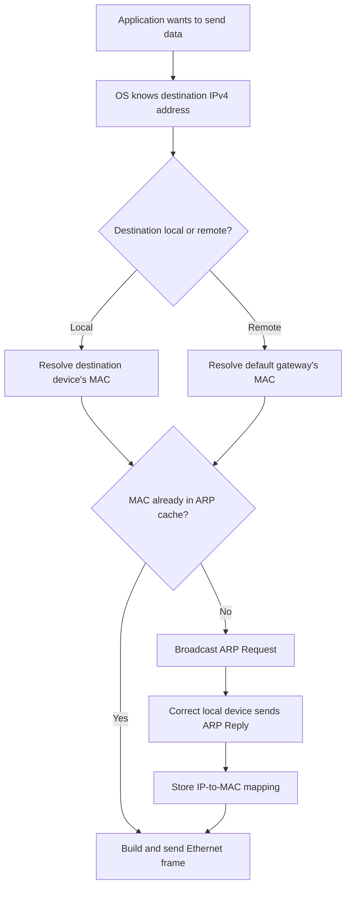

# 🌐 Day 12 — Address Resolution Protocol (ARP)

## 📌 Today’s Focus

Today I explored **ARP (Address Resolution Protocol)** and understood how a computer discovers the MAC address required to deliver an Ethernet frame inside a local network.

I also created a small network in Cisco Packet Tracer, tested communication between four computers, and examined the dynamically learned ARP entries using the `arp -a` command.

---

## 🧠 My Core Understanding

A computer normally knows the destination’s **IP address**, but Ethernet communication on a local network requires a **destination MAC address**.

ARP solves this problem by answering:

> “Which MAC address belongs to this local IPv4 address?”

The result is stored temporarily in the computer’s **ARP cache**.

```text
Known IPv4 address
        │
        ▼
   ARP Resolution
        │
        ▼
Discovered MAC address
        │
        ▼
Ethernet frame can be delivered
```

---

## 🔎 What Does ARP Mean?

**ARP** stands for **Address Resolution Protocol**.

It is primarily used with **IPv4** to discover the MAC address associated with an IPv4 address inside the local network.

```text
IPv4 address  ──ARP──►  MAC address
```

Example:

```text
192.168.1.2  ───────►  0005.5e3a.6cab
```

ARP operates only within the local **broadcast domain**.

A broadcast domain is the group of devices that can receive the same Layer 2 broadcast. Routers normally do not forward ARP broadcasts into other networks.

---

## ❓ Why Is ARP Necessary?

IP addresses and MAC addresses have different responsibilities.

| Address | Main purpose |
|---|---|
| IP address | Identifies the source and destination across networks |
| MAC address | Delivers an Ethernet frame across the current local network |
| Port number | Identifies the application or service on a computer |

Suppose PC A wants to send data to PC B.

PC A may already know PC B’s IP address, but it must also know the correct destination MAC address before it can create the Ethernet frame.

```text
PC A knows:

Destination IP  ✅
Destination MAC ❌
```

ARP discovers the missing destination MAC address.

---

## 🖥️ Local Network Example

Assume the network contains:

```text
PC A: 192.168.1.1
PC B: 192.168.1.2
PC C: 192.168.1.3
PC D: 192.168.1.4
```

All four computers are connected to the same switch and belong to the same subnet.

```text
                  ┌──────────────┐
                  │    Switch    │
                  └──────┬───────┘
            ┌────────────┼────────────┐
            │            │            │
        ┌───▼───┐    ┌───▼───┐    ┌───▼───┐
        │ PC A  │    │ PC B  │    │ PC C  │
        │ .1    │    │ .2    │    │ .3    │
        └───────┘    └───────┘    └───────┘
                                      │
                                  ┌───▼───┐
                                  │ PC D  │
                                  │ .4    │
                                  └───────┘
```

---

## 🔄 How ARP Works

Suppose PC A wants to communicate with PC B at `192.168.1.2`.

### Step 1: PC A checks its ARP cache

Before sending an ARP Request, PC A checks whether it already knows the MAC address associated with `192.168.1.2`.

```text
Does the ARP cache contain 192.168.1.2?

Yes ──► Use the cached MAC address
No  ──► Send an ARP Request
```

If the entry exists, no new ARP broadcast is required.

---

### Step 2: PC A sends an ARP Request

If the mapping is missing, PC A sends a broadcast message:

```text
Who has 192.168.1.2?
Tell 192.168.1.1.
```

The Ethernet destination MAC address is:

```text
FF:FF:FF:FF:FF:FF
```

`FF:FF:FF:FF:FF:FF` is the Ethernet broadcast address.

This means every device in the local broadcast domain can receive the frame.

---

### Step 3: The switch floods the broadcast

PC A creates the broadcast frame. The switch does not create the broadcast.

When the switch receives the frame, it floods it through the relevant switch ports except the port where the frame originally arrived.

```text
PC A creates broadcast
          │
          ▼
       Switch
          │
          ├──► PC B
          ├──► PC C
          └──► PC D
```

The correct terminology is:

```text
Computer broadcasts
Switch floods the broadcast
```

---

### Step 4: Every computer examines the target IP

Every computer receives the broadcast frame and examines the **target IP address** inside the ARP Request.

```text
Target IP: 192.168.1.2
```

PC C and PC D recognize that the target IP does not belong to them, so they ignore the request.

PC B recognizes that `192.168.1.2` is its own IP address.

---

### Step 5: PC B sends an ARP Reply

PC B sends an ARP Reply directly to PC A.

The response contains information similar to:

```text
192.168.1.2 is at 0005.5e3a.6cab
```

Unlike the ARP Request, the normal ARP Reply is usually **unicast**.

Unicast means that the frame is addressed to one specific destination device.

---

### Step 6: PC A updates its ARP cache

PC A stores the learned mapping:

```text
192.168.1.2 → 0005.5e3a.6cab
```

PC A can now create an Ethernet frame containing PC B’s MAC address.

```text
Source IP:        192.168.1.1
Destination IP:   192.168.1.2

Source MAC:       PC A's MAC
Destination MAC:  PC B's MAC
```

---

### Step 7: Communication continues directly

Future frames can be forwarded directly toward PC B while the ARP entry remains valid.

The device does not need to broadcast another ARP Request for every frame.

```text
First communication:

ARP Request  → Broadcast
ARP Reply    → Unicast
Data frame   → Unicast
```

```text
Later communication:

ARP cache lookup → MAC found → Data frame sent as unicast
```

---

## 🗺️ Complete ARP Flow



---

## 📒 ARP Cache

An **ARP cache** is a table maintained by a computer or router that stores recently learned IPv4-to-MAC address mappings.

Example:

| Internet address | Physical address | Type |
|---|---|---|
| `192.168.1.2` | `0005.5e3a.6cab` | Dynamic |
| `192.168.1.3` | `0090.0c77.78b7` | Dynamic |
| `192.168.1.4` | `000c.c981.9ec7` | Dynamic |

Terminology:

- **Internet address:** IPv4 address
- **Physical address:** MAC address
- **Type:** How the mapping was added

The ARP cache prevents unnecessary broadcasts by allowing the computer to reuse previously discovered mappings.

---

## 🧾 Viewing the ARP Cache in Windows

The following Windows command displays the current ARP cache:

```powershell
arp -a
```

The output contains:

```text
Internet Address      Physical Address      Type
```

| Column | Meaning |
|---|---|
| Internet Address | Neighbor’s IPv4 address |
| Physical Address | Neighbor’s MAC address |
| Type | Whether the mapping is dynamic or static |

An IP address alone is not a command.

For example:

```text
192.168.1.2
```

produces an invalid-command message in Packet Tracer.

To test communication, the correct command is:

```powershell
ping 192.168.1.2
```

---

## 🔁 Dynamic and Static ARP Entries

### Dynamic entry

A **dynamic** ARP entry is learned automatically through ARP communication.

```text
192.168.1.2 → 0005.5e3a.6cab → dynamic
```

Dynamic entries are temporary and can expire after a period of inactivity.

### Static entry

A **static** ARP entry is manually configured.

It does not age in the same way as a normal dynamically learned entry, although its exact behavior can depend on the operating system and configuration.

| Entry type | Created by | Normal behavior |
|---|---|---|
| Dynamic | Learned automatically | Temporary and can expire |
| Static | Added manually | Remains until removed or reconfigured |

---

## 🟢 Reachable and Stale Neighbor States

`Reachable` and `Stale` are neighbor states rather than the basic entry types normally shown by `arp -a`.

Modern Windows systems can display neighbor information using:

```powershell
Get-NetNeighbor
```

Common states include:

| State | Meaning |
|---|---|
| Reachable | The system recently confirmed that the neighbor can be reached |
| Stale | The mapping exists, but it has not been recently confirmed |
| Incomplete | Address resolution has started, but no complete reply has been received |
| Permanent | A permanently configured neighbor entry |

`Stale` does not automatically mean the device is unreachable. It means the operating system may need to verify the neighbor again before or during future communication.

---

## 🧩 ARP Cache vs Switch MAC Address Table

Computers and switches maintain different tables for different purposes.

| Device | Table | Mapping |
|---|---|---|
| Computer | ARP cache | IPv4 address → MAC address |
| Switch | MAC/CAM table | MAC address → switch port |

### Computer’s ARP cache

```text
192.168.1.2 → 0005.5e3a.6cab
```

This answers:

> “Which MAC address belongs to this IPv4 address?”

### Switch’s MAC address table

```text
0005.5e3a.6cab → FastEthernet0/2
```

This answers:

> “Through which switch port can this MAC address be reached?”

These tables work together, but they are not the same table.

```text
Computer:
Destination IP → Destination MAC

Switch:
Destination MAC → Outgoing switch port
```

---

## 🧭 Who Decides Whether the Destination Is Local?

The Ethernet frame does not decide where the traffic should go.

The computer’s operating system makes the decision before creating the frame.

It uses:

- Its own IP address
- Its subnet mask
- The destination IP address
- Its routing table
- Its configured default gateway

The computer compares the source and destination network information to determine whether the destination is:

```text
Inside the local subnet
          OR
Outside the local subnet
```

This connects directly to my previous subnetting work.

---

## 🏠 Sending to a Device in the Same Network

Assume:

```text
PC A:           192.168.1.10/24
Destination:    192.168.1.25
Local network:  192.168.1.0/24
```

Because the destination belongs to the same subnet, PC A resolves the destination device’s MAC address.

```text
ARP question:

Who has 192.168.1.25?
```

The resulting frame contains:

```text
Destination MAC: PC B's MAC
Destination IP:  192.168.1.25
```

---

## 🌍 Sending to a Different Network

Assume:

```text
PC A:            192.168.1.10/24
Default gateway: 192.168.1.1
Destination:     8.8.8.8
```

The operating system determines that `8.8.8.8` is outside the local subnet.

PC A does not ask:

```text
Who has 8.8.8.8?
```

Instead, it determines that the packet must be sent to its default gateway.

If the gateway’s MAC address is not already cached, PC A asks:

```text
Who has 192.168.1.1?
```

The first frame then contains:

```text
Destination MAC: Router's local MAC address
Destination IP:  8.8.8.8
```

The MAC address identifies the next local hop, while the IP address identifies the final network destination.

---

## 🪜 Hop-by-Hop Delivery

MAC addresses are used only across the current local link.

When a router forwards a packet, it removes the old Layer 2 frame and creates a new frame for the next link.

```text
PC A
IP destination: 8.8.8.8
MAC destination: Router 1
        │
        ▼
Router 1
IP destination: 8.8.8.8
MAC destination: Next hop
        │
        ▼
Router 2
IP destination: 8.8.8.8
MAC destination: Next hop
        │
        ▼
Final network
```

Therefore:

- The destination IP generally remains the final destination across the route.
- The source and destination MAC addresses change from link to link.
- PC A does not discover Google’s final MAC address.
- PC A only needs the MAC address of its next hop: the default gateway.

---

## 🏢 Security-Guard Analogy

I used a security-guard analogy to understand address mapping.

A security guard may keep a record connecting a resident’s name with an apartment door number.

```text
Person's name → Apartment number
```

Similarly, a computer keeps a mapping between an IPv4 address and a MAC address.

```text
IPv4 address → MAC address
```

When local delivery information is missing, the computer asks the local network who owns the destination IPv4 address.

However, the analogy has a limit: ARP is not a central directory maintained by the switch. Each computer maintains its own ARP cache.

---

## 🧪 Packet Tracer Lab

### Lab topology

I created a Cisco Packet Tracer network containing:

- One switch
- Four computers
- IPv4 addresses in the same local network

The addresses included:

```text
192.168.1.1
192.168.1.2
192.168.1.3
192.168.1.4
```

### Lab objective

The objective was to:

1. Test connectivity using `ping`.
2. Allow ARP resolution to occur.
3. View the learned IPv4-to-MAC mappings.
4. Observe how the ARP cache grows as additional devices are contacted.

---

## 🧪 Commands Used

I first contacted `192.168.1.2`:

```powershell
ping 192.168.1.2
```

Then I examined the ARP cache:

```powershell
arp -a
```

One dynamic entry appeared:

```text
Internet Address      Physical Address      Type
192.168.1.2           0005.5e3a.6cab       dynamic
```

I then contacted two more devices:

```powershell
ping 192.168.1.3
ping 192.168.1.4
```

After running `arp -a` again, the ARP cache contained three dynamic entries:

```text
Internet Address      Physical Address      Type
192.168.1.2           0005.5e3a.6cab       dynamic
192.168.1.3           0090.0c77.78b7       dynamic
192.168.1.4           000c.c981.9ec7       dynamic
```

---

## 📸 Lab Evidence

In my Packet Tracer lab, I recorded successful pings to `192.168.1.2`, `192.168.1.3`, and `192.168.1.4`, with zero packet loss in the displayed tests. I also recorded three dynamically learned entries in PC0's ARP cache after communication with the local devices.

The screenshot described in my original notes is not currently included in this repository. These written observations describe the lab result, but a reader cannot independently inspect the screenshot here.

The ARP cache observations also do not show the individual ARP Request and ARP Reply frames. Packet Tracer Simulation Mode or a packet capture would be needed to inspect those messages directly.

---

## 🔐 ARP Security Weakness

ARP was designed for address resolution, not authentication.

A receiving computer normally trusts the ARP information it receives. ARP does not have a built-in mechanism for proving that a claimed IPv4-to-MAC mapping is legitimate.

This creates an opportunity for ARP-based attacks.

---

## 🎭 ARP Spoofing

**ARP spoofing** means sending forged ARP information to mislead another device.

An attacker may falsely claim:

```text
The default gateway's IP address belongs to my MAC address.
```

Example:

```text
Legitimate mapping:
192.168.1.1 → Router's MAC

Forged mapping:
192.168.1.1 → Attacker's MAC
```

If the victim accepts the forged mapping, frames intended for the router may be sent to the attacker instead.

---

## ☠️ ARP Poisoning

**ARP poisoning** refers to corrupting a device’s ARP cache with a false IPv4-to-MAC mapping.

Forged ARP messages may be sent repeatedly to keep the incorrect mapping active.

ARP spoofing and ARP poisoning are closely related and are sometimes used as interchangeable terms:

```text
ARP spoofing  → Sending forged ARP information
ARP poisoning → False mapping stored in the victim's ARP cache
```

A successful attack may be used to support:

- Man-in-the-middle interception
- Traffic redirection
- Session disruption
- Denial of service
- Credential or data theft when higher-layer protection is absent

---

## 🛡️ Common ARP Protections

Possible defenses include:

- **Dynamic ARP Inspection:** A switch feature that validates ARP messages against trusted address information.
- **DHCP Snooping:** Builds a trusted database of assigned IP and MAC address combinations.
- **Static ARP entries:** Useful in limited environments, but difficult to manage at scale.
- **Network segmentation:** Reduces the number of devices within one broadcast domain.
- **Monitoring:** Detects unexpected changes in IPv4-to-MAC mappings.
- **Encrypted protocols:** HTTPS, SSH and VPNs help protect data even if traffic is redirected.

Encryption does not prevent ARP poisoning itself, but it can reduce the attacker’s ability to read or modify protected application data.

---

## ⚠️ Important Corrections and Misconceptions

### Misconception 1: The switch maintains the ARP mapping for every computer

Correction:

```text
Computer ARP cache: IPv4 address → MAC address
Switch MAC table:   MAC address → switch port
```

---

### Misconception 2: The switch creates the ARP broadcast

Correction:

The requesting computer creates the broadcast frame. The switch floods that frame through the local broadcast domain.

---

### Misconception 3: Devices compare the broadcast destination MAC with their own MAC

Correction:

The destination MAC is `FF:FF:FF:FF:FF:FF`, so all local devices initially accept the broadcast frame. They then inspect the target IPv4 address inside the ARP message.

---

### Misconception 4: ARP establishes a connection

Correction:

ARP resolves an IPv4 address into a MAC address. It does not establish a connection or perform a handshake.

TCP can establish a logical connection using its three-way handshake. ARP does not.

---

### Misconception 5: A computer ARPs for a remote destination

Correction:

For a remote destination, the computer ARPs for the local default gateway—not for the final remote server.

---

### Misconception 6: A remote server’s MAC travels across the internet

Correction:

MAC addresses have local-link significance. Routers replace Layer 2 headers at every routed hop.

---

## 🔗 Connection to Previous Topics

ARP connects several concepts I previously explored:

| Previous topic | Connection to ARP |
|---|---|
| IPv4 addressing | ARP begins with a known local IPv4 address |
| Subnet mask | Determines whether the destination is local or remote |
| Network ID | Helps identify the local subnet |
| MAC address | Becomes the Layer 2 destination |
| OSI model | ARP connects Layer 3 addressing with Layer 2 delivery |
| Ethernet frame | Requires source and destination MAC addresses |
| Switch | Forwards frames using its MAC address table |
| Router | Acts as the next hop for remote networks |
| ICMP/ping | May trigger ARP before the first ICMP Echo Request is sent |
| TCP/UDP | Their data is carried only after lower-layer delivery information is available |

---

## 🧠 Final Mental Model

```text
Application wants to communicate
              │
              ▼
OS examines destination IP
              │
              ▼
Is the destination inside my subnet?
        ┌─────┴─────┐
        │           │
       Yes          No
        │           │
        ▼           ▼
Use target IP   Use gateway IP
for ARP         for ARP
        │           │
        └─────┬─────┘
              ▼
Check ARP cache
              │
       ┌──────┴──────┐
       │             │
   Entry found    Entry missing
       │             │
       │             ▼
       │      Broadcast ARP Request
       │             │
       │      Receive ARP Reply
       │             │
       └──────┬──────┘
              ▼
Build Ethernet frame
              │
              ▼
Switch forwards the frame
```

---

## 📝 What I Learned

Today I learned that ARP is a small but essential protocol that connects IPv4 addressing with Ethernet delivery.

My main understanding is:

- ARP resolves a local IPv4 address into a MAC address.
- The requesting computer checks its ARP cache first.
- An ARP Request is normally broadcast.
- The switch floods the broadcast inside the local broadcast domain.
- Only the device owning the target IPv4 address replies.
- An ARP Reply is normally unicast.
- Learned mappings are stored in the ARP cache.
- A switch’s MAC table is different from a computer’s ARP cache.
- The operating system decides whether a destination is local or remote.
- For remote traffic, the computer resolves the default gateway’s MAC address.
- MAC addresses change at each routed hop.
- ARP does not establish a connection.
- ARP lacks built-in authentication and is vulnerable to spoofing and poisoning.

---

## ✅ Day 12 Outcome

By the end of this work, I was able to:

- Explain why ARP is necessary.
- Describe the ARP Request and ARP Reply process.
- Distinguish broadcast, flooding and unicast behavior.
- View dynamic ARP entries using `arp -a`.
- Explain the difference between an ARP cache and a switch MAC table.
- Explain local delivery versus default-gateway delivery.
- Connect ARP behavior with subnetting and routing decisions.
- Identify the basic risk of ARP spoofing and ARP poisoning.
- Demonstrate ARP learning in Cisco Packet Tracer.

---

## 🔍 Self-Check

1. Why does a computer require a MAC address after it already knows the destination IP?
2. What destination MAC address is used for an ARP Request?
3. Why does only one computer normally answer an ARP Request?
4. What is the difference between an ARP cache and a switch MAC table?
5. When contacting `8.8.8.8`, why does the frame contain the router’s MAC address?
6. Why can ARP spoofing succeed on an unprotected local network?
