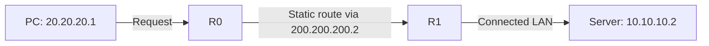
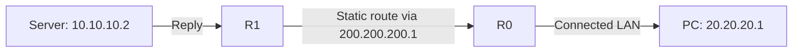

# 🌐 Day 16 — Static IP Routing Between Two Routers

<!-- portfolio-quick-review:start -->
## ⚡ Quick review

- **Problem:** Each router knew its directly connected networks but needed a route to the LAN behind the other router.
- **Actions:** I built a two-router topology, configured interfaces and static routes, inspected both routing tables, and tested communication with `ping`.
- **Result:** Both routers displayed the expected static routes. Devices on opposite LANs exchanged ping traffic, although one recorded test received three of four replies.
- **Key understanding:** A successful exchange needs a route for the request **and** a route for the reply.
- **Evidence:** My Packet Tracer topology, router CLI screenshots, `show ip route` output, and PC/server ping results.

[Read the full learning notes ↓](#full-learning-notes)

---

<a id="full-learning-notes"></a>
<!-- portfolio-quick-review:end -->

## 📌 What changed from Day 15?

On Day 15, I connected two LANs using **one router**. That router had an active interface in each LAN, so both networks appeared as **directly connected** routes.

Today I used **two routers**. Each router connects to its own LAN and to the link between the routers. The LAN on the other side is a **remote network**. I added a static route on each router to tell it which neighboring router can reach that remote network.

> **My starting mental model:** A router automatically knows networks attached to its active interfaces. For a network behind another router, I can manually provide a route to the next router.

---

## 🎯 What I practiced

- Building and addressing a two-router Packet Tracer topology.
- Identifying directly connected and remote networks.
- Enabling router interfaces with `no shutdown`.
- Adding static routes with `ip route`.
- Configuring a return route on the second router.
- Reading connected (`C`) and static (`S`) entries in `show ip route`.
- Testing traffic between devices on different LANs.
- Explaining why a ping needs both a forward path and a return path.
- Troubleshooting a route command, an interface address, and Cisco CLI modes.

---

## 🧠 What is a static route?

A **route** tells a router where to forward a packet based on its destination IP address. A **static route** is a route entered manually by an administrator.

The Cisco IOS command used in this lab is:

```cisco
ip route <destination-network> <subnet-mask> <next-hop-IP>
```

| Part | Meaning |
|---|---|
| Destination network | The remote network I want the router to reach |
| Subnet mask | The range of destination addresses covered by the route |
| Next-hop IP | The neighboring router to which this router sends the packet |

For example:

```cisco
ip route 10.10.10.0 255.255.255.0 200.200.200.2
```

I read this as:

> “To reach the `10.10.10.0/24` network, send the packet to my neighboring router at `200.200.200.2`.”

`10.10.10.0` is the **network address** in this command. It describes the destination LAN, rather than just one server in that LAN.

---

## 🧪 First two-router example

My first two-router example used these networks:

| Segment | Network |
|---|---|
| Left LAN | `192.168.1.0/24` |
| Link between routers | `200.200.200.0/24` |
| Right LAN | `192.168.0.0/24` |

The left router used `200.200.200.1` on the link. The right router used `200.200.200.2`.

On the left router, the command to reach the right LAN was:

```cisco
enable
configure terminal
ip route 192.168.0.0 255.255.255.0 200.200.200.2
end
write memory
show ip route
```

The routing table displayed:

```text
S 192.168.0.0/24 [1/0] via 200.200.200.2
C 192.168.1.0/24 is directly connected, FastEthernet0/1
C 200.200.200.0/24 is directly connected, FastEthernet0/0
```

Here is how I interpret that output:

- **`S` means static:** I entered the route to `192.168.0.0/24` manually.
- **`C` means connected:** The router has an active interface in that network.
- **`via 200.200.200.2`** identifies the next router for the remote LAN.
- **`[1/0]`** displays administrative distance and metric in this routing-table entry.

This example helped me see the difference between a network attached to my router and a network reached **through another router**.

---

## 🏠 My independent Packet Tracer lab

After practicing the initial example, I built my own topology with PCs on the left and servers on the right. The tested path used **two routers**, R0 and R1.

### Packet Tracer project

[Open my two-router static-routing lab](home-lab-static-routing.pkt). The `.pkt` file contains the editable topology and router configurations. I will place it beside this README when publishing so the link opens the actual lab in Packet Tracer.


Each LAN contains a switch connecting its end devices to the router. The switches do not add a new routed hop.

| Segment | Network | Router interface address |
|---|---|---|
| Left LAN with PCs | `20.20.20.0/24` | R0: `20.20.20.254` |
| Link between routers | `200.200.200.0/24` | R0: `200.200.200.1`; R1: `200.200.200.2` |
| Right LAN with servers | `10.10.10.0/24` | R1: `10.10.10.254` |

An unattached third router icon appeared in one workspace screenshot. It was not part of this tested two-router path.

### Which networks does each router know directly?

R0 has interfaces in:

```text
20.20.20.0/24
200.200.200.0/24
```

R1 has interfaces in:

```text
200.200.200.0/24
10.10.10.0/24
```

Therefore:

- R0 needs a route to the remote `10.10.10.0/24` LAN.
- R1 needs a route to the remote `20.20.20.0/24` LAN.

---

## 🔧 Router interface configuration

These commands show how to reproduce the address plan in my topology. The interface names must match the actual router ports used in Packet Tracer.

### R0: left LAN and router-to-router link

```cisco
enable
configure terminal

interface fastEthernet0/0
 ip address 200.200.200.1 255.255.255.0
 no shutdown
exit

interface fastEthernet0/1
 ip address 20.20.20.254 255.255.255.0
 no shutdown
exit

end
show ip interface brief
```

### R1: router-to-router link and right LAN

```cisco
enable
configure terminal

interface fastEthernet0/0
 ip address 200.200.200.2 255.255.255.0
 no shutdown
exit

interface fastEthernet0/1
 ip address 10.10.10.254 255.255.255.0
 no shutdown
exit

end
show ip interface brief
```

`ip address` gives an interface its Layer 3 address and mask. `no shutdown` enables that interface. `show ip interface brief` lets me check its assigned address and whether its status and protocol are **up/up**.

The screenshots include parts of my command history and my corrected R1 LAN address; these blocks collect the commands needed to reproduce the visible address plan.

---

## 🛣️ My static routes

### On R0: reach the right LAN through R1

```cisco
enable
configure terminal
ip route 10.10.10.0 255.255.255.0 200.200.200.2
end
write memory
```

R0's next hop is R1's address, `200.200.200.2`, on the network they share.

### On R1: reach the left LAN through R0

```cisco
enable
configure terminal
ip route 20.20.20.0 255.255.255.0 200.200.200.1
end
write memory
```

R1's next hop is R0's address, `200.200.200.1`, on the same shared network.

**Why did I add two routes?** One carries traffic toward the server LAN. The other provides a path back toward the PC LAN. The request and the reply have opposite destinations.

`write memory`, abbreviated `wr`, saves the configuration. Saving it does not itself verify that packets can travel across the network.

---

## 🔎 Verifying the routes

At the privileged `#` prompt, I used:

```cisco
show ip route
```

My home-lab screenshot shows these entries on **R0**:

```text
S 10.10.10.0 [1/0] via 200.200.200.2
C 20.20.20.0 is directly connected, FastEthernet0/1
C 200.200.200.0 is directly connected, FastEthernet0/0
```

It shows these entries on **R1**:

```text
C 10.10.10.0 is directly connected, FastEthernet0/1
S 20.20.20.0 [1/0] via 200.200.200.1
C 200.200.200.0 is directly connected, FastEthernet0/0
```

Packet Tracer also displays subnet headings around some routing-table entries. The checks that matter to me are:

1. R0 has an **`S` route** toward the right LAN through R1.
2. R1 has an **`S` route** toward the left LAN through R0.
3. Each router has **`C` routes** for its own LAN and the link between routers.

**`S` is an output code, not a command.** I create the route with `ip route ...` and inspect the result with `show ip route`.

Both home-lab routing tables also displayed:

```text
Gateway of last resort is not set
```

That means there was no **default route** for destinations that did not match another route. It did not stop traffic between my three documented networks because their required routes were present.

Seeing an `S` entry confirms that the router has installed the static route. An end-device ping tests whether the packet can actually make the trip and receive a reply.

---

## ✅ Ping results

From a PC on the left, a ping to `10.10.10.2` on the right showed:

```text
Sent = 4, Received = 4, Lost = 0 (0% loss)
```

Another PC ping, to `10.10.10.1`, showed one timeout followed by three replies:

```text
Sent = 4, Received = 3, Lost = 1 (25% loss)
```

From a server on the right, a ping to `20.20.20.1` on the left showed:

```text
Sent = 4, Received = 4, Lost = 0 (0% loss)
```

These tests provide evidence that the **tested devices** communicated across the two-router topology. I should report the second test as three replies out of four, rather than describe every test as having zero loss. The screenshot does not establish the cause of its single timeout.

---

## ↔️ My key understanding: a ping needs a return path

Here is one ping from a left-side PC to a right-side server. The request and reply travel in opposite directions. I have drawn them separately so I can see which router needs each static route.

**Request: the PC reaches the server**



**Reply: the server reaches the PC**



### Step by step

1. The PC creates an **ICMP echo request** with source IP `20.20.20.1` and destination IP `10.10.10.2`.
2. The destination is outside the PC's `20.20.20.0/24` subnet. The PC sends the packet to its default gateway, R0 at `20.20.20.254`.
3. R0 matches its static route for `10.10.10.0/24` and forwards the packet to R1 at `200.200.200.2`.
4. R1 is directly connected to `10.10.10.0/24` and delivers the request to the server.
5. The server creates an **ICMP echo reply** destined for `20.20.20.1`. Because that IP is outside the server's subnet, it sends the reply to its default gateway, R1 at `10.10.10.254`.
6. R1 matches its static route for `20.20.20.0/24` and forwards the reply to R0 at `200.200.200.1`.
7. R0 delivers the reply to the PC. The PC can now report a successful ping.

### What if I remove R1's route to `20.20.20.0/24`?

The **request can still reach the server** because R0's route to `10.10.10.0/24` is intact. The server sends its reply to its gateway, R1. But R1 no longer has its route to the PC's network, and my lab has no default route to use instead. The reply cannot get back to the PC.


The PC therefore reports a failed ping **even though its request reached the server**.

The server knows the reply's destination IP and sends it to its gateway. It is **R1's missing route**, rather than the server not knowing the PC's address, that stops the return packet.

### What if I restore R1's route but remove R0's route to `10.10.10.0/24`?

**R0 gets stuck first.** The PC sends the request to R0, but R0 has no route to the right-side server LAN and no default route in this lab. The request does not reach R1 or the server.

> **My mental model:** Sending a request and receiving its reply are two routing decisions. A route in one direction does not automatically create a route in the other direction.

A different lab might have another matching route, such as a default route. My conclusion above applies to the routing tables shown in this lab, where the gateway of last resort was not set.

---

## 🛠️ Mistakes I learned from

### 1. An inconsistent destination address and mask

While entering a route, I encountered:

```text
%Inconsistent address and mask
```

I had tried a host address such as `10.10.10.1` as the destination alongside a `/24` mask. To describe that entire `/24` LAN, I needed its **network address**:

```cisco
ip route 10.10.10.0 255.255.255.0 200.200.200.2
```

`10.10.10.1` can identify a host in that subnet. `10.10.10.0` identifies the subnet itself.

### 2. An unsuitable interface address

During an earlier R1 configuration attempt, the CLI screenshot showed `10.10.10.0` entered as an interface address. For `10.10.10.0/24`, `.0` is the network address, not a normal host address to use for the router interface. I later changed the interface to:

```cisco
interface fastEthernet0/1
 ip address 10.10.10.254 255.255.255.0
 no shutdown
```

The distinction is now clearer to me:

- A **static route's destination** can be the network `10.10.10.0/24`.
- The **router interface** needs a usable address inside that network, such as `10.10.10.254/24`.

### 3. Entering a command at the wrong prompt

Cisco IOS changes which commands it accepts depending on the current CLI mode:

| Prompt | Mode | What I do there |
|---|---|---|
| `Router>` | User EXEC | Enter `enable` |
| `Router#` | Privileged EXEC | Run `show ip route` or enter `configure terminal` |
| `Router(config)#` | Global configuration | Enter `ip route ...` |
| `Router(config-if)#` | Interface configuration | Enter `ip address ...` and `no shutdown` |

Reading the prompt before typing a command helps me distinguish a syntax error from being in the wrong mode.

---

## 🔍 My troubleshooting order

If a PC cannot reach a device behind the other router, I will check:

1. **The PC:** Does it have the correct IP address, subnet mask, and default gateway?
2. **The interfaces:** Does `show ip interface brief` show the participating router interfaces as up/up?
3. **The shared link:** Can each router reach its neighbor's `200.200.200.x` address?
4. **The forward route:** Does the first router have a route to the destination LAN?
5. **The return route:** Does the second router have a route to the source LAN?
6. **The actual traffic:** Can the end devices exchange pings?

Useful router commands:

```cisco
show ip interface brief
show ip route
show running-config
ping <destination-IP>
```

Useful Packet Tracer PC commands:

```text
ipconfig
ping <local-gateway-IP>
ping <remote-device-IP>
tracert <remote-device-IP>
```

I first decide **what each command should reveal**. A routing-table entry tells me about the router's forwarding information; a ping tells me whether a tested device received a reply.

---

## 🔐 Why this matters for cybersecurity

When investigating failed traffic, “the server is down” is only one possible explanation. The packet may be stopped by an incorrect client gateway, a disabled interface, a missing forward route, or a missing return route.

A security professional needs to identify **where the traffic stops** before deciding whether a firewall rule, service problem, or routing problem is responsible. In this lab, removing R1's return route provides a concrete example: the server can receive a request, but the PC cannot receive its reply.

---

## 🧠 My Day 16 takeaway

I configured static routing between two routers and verified the routes using `show ip route`. The `C` entries showed the networks attached to each router's active interfaces. The `S` entries showed the remote networks for which I manually provided a next hop.

My most useful realization came from tracing a ping **both ways**. If R1 loses its route back to the PC LAN, the request may still reach the server, but the reply gets stuck at R1. If R0 loses its route to the server LAN, the request gets stuck at R0 before reaching the server.

**Next practice:** Remove and restore each static route in Packet Tracer, predict where the packet will stop, then compare that prediction with the routing tables and ping results.
