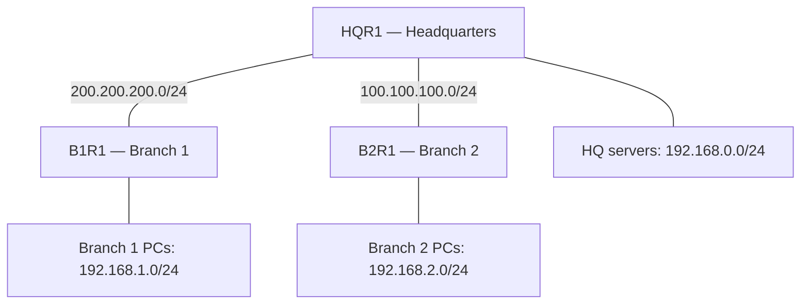

# 🌐 Day 17 — Default Static Routing with HQ and Two Branches

<!-- portfolio-quick-review:start -->
## ⚡ Quick review

- **Problem:** Two branch networks need to reach headquarters and other remote networks without adding a separate route for every destination on each branch router.
- **Approach:** Configure a default static route toward HQ on each branch router, and specific static routes toward the branch LANs on HQ.
- **Observed results:** The reviewed routing tables show both branch default routes and HQ’s routes to both branch LANs. PC2 received replies from three HQ servers, and a traceroute to one HQ server completed.
- **Key understanding:** A default route provides a fallback next hop. Every router along the path still needs a matching route, including for the reply.
- **Project status:** My Packet Tracer project is saved locally. Its repository upload is pending.

[Read the full learning notes ↓](#full-learning-notes)

---

<a id="full-learning-notes"></a>
<!-- portfolio-quick-review:end -->

## 📌 What changed from Day 16?

On [Day 16](../day-16-two-router-static-routing/README.md), I worked with two routers and configured specific static routes toward the remote LAN on each side.

Day 17 extends the idea to **three routers**:

- **B1R1:** Branch 1 router.
- **HQR1:** Headquarters router.
- **B2R1:** Branch 2 router.

Both branches connect through HQ.

The important change is the routing strategy:

| Router role | Routing strategy |
|---|---|
| Branch router | Send traffic to HQ when no more-specific route matches |
| HQ router | Use specific routes to select the correct branch |

This is **default static routing in a three-router topology**. The number of routers does not define a separate routing protocol.

> **My mental model:** Each branch has one way out—through HQ. HQ needs to know which branch leads to each remote LAN.

---

## 🎯 What I practiced

- Understanding default routes and when a router uses them.
- Reading the command `ip route 0.0.0.0 0.0.0.0 <next-hop-IP>`.
- Combining branch default routes with specific routes at HQ.
- Identifying connected, static, and candidate default routes.
- Checking interface IP addresses as well as link status.
- Following a packet’s forward and return paths.
- Interpreting ping and traceroute evidence.
- Preparing a saved Packet Tracer project for my portfolio.

The address plan and outputs below document the reviewed example. My separately saved project will be attached after transferring it from Windows to Ubuntu.

---

## 🗺️ Network topology



Each LAN uses a switch to connect its end devices to its router. These Layer 2 switches do not add routed hops to traceroute.

This arrangement is called **hub-and-spoke**: HQ is the central hub, and the branches are the spokes.

### Address plan

| Segment | Network | Router addresses |
|---|---|---|
| Branch 1 LAN | `192.168.1.0/24` | B1R1: `192.168.1.254` |
| Branch 1–HQ link | `200.200.200.0/24` | B1R1: `200.200.200.1`; HQ: `200.200.200.2` |
| HQ LAN | `192.168.0.0/24` | HQ: `192.168.0.254` |
| HQ–Branch 2 link | `100.100.100.0/24` | HQ: `100.100.100.2`; B2R1: `100.100.100.1` |
| Branch 2 LAN | `192.168.2.0/24` | B2R1: `192.168.2.254` |

All listed networks use mask `255.255.255.0`.

The HQ server addresses tested were:

```text
192.168.0.100
192.168.0.101
192.168.0.102
```

The transit addresses above reproduce the isolated example. They are not RFC 1918 private addresses; a separate private lab can use non-overlapping private subnets instead.

### End-device default gateways

| Device location | Default gateway |
|---|---|
| Branch 1 LAN | `192.168.1.254` |
| HQ LAN | `192.168.0.254` |
| Branch 2 LAN | `192.168.2.254` |

A host’s default gateway is its local router address. It is not the far-side HQ address on a different subnet.

---

## 🧠 What is a default static route?

A **static route** is configured manually.

A **default route** covers all IPv4 destinations as `0.0.0.0/0`. It is used when no more-specific route matches the destination.

A route can be both static and default.

```cisco
ip route 0.0.0.0 0.0.0.0 200.200.200.2
```

| Part | Meaning |
|---|---|
| `ip route` | Configure a static IPv4 route |
| First `0.0.0.0` | Default destination network |
| Second `0.0.0.0` | Mask with zero fixed network bits |
| `200.200.200.2` | Next-hop IP: HQ’s neighboring interface |

I read this as:

> “If no more-specific route matches the destination, forward the packet to HQ at `200.200.200.2`.”

The final address is the **next hop**, not the final destination host. Forwarding through HQ does not change the packet’s destination IP to HQ’s address.

### Why does `/0` match everything?

A prefix length tells the router how many leading address bits must match.

- `/24`: the first 24 bits must match.
- `/0`: zero bits must match, so any IPv4 destination matches.

The router selects the **longest matching prefix**—the matching route that describes the smallest address range.

For example, on B1R1:

| Destination | Matching route selected | Reason |
|---|---|---|
| `192.168.1.10` | Connected `192.168.1.0/24` | `/24` is more specific than `/0` |
| `192.168.0.101` | Default `0.0.0.0/0` | No more-specific route is shown |
| `192.168.2.10` | Default `0.0.0.0/0` | No more-specific route is shown |

A default route does **not** force local LAN traffic through HQ.

---

## 🏢 Why do the branches use default routes?

Each branch has one upstream neighbor: HQ.

Without a default route, a branch could require separate routes for the HQ LAN and the other branch LAN. A default route lets both destinations use the same next hop.

HQ has a different responsibility. It must distinguish between:

- `192.168.1.0/24` behind Branch 1.
- `192.168.2.0/24` behind Branch 2.

Therefore, HQ uses specific routes toward those networks.

> A branch can say “send unmatched traffic to HQ,” but HQ still needs to know where to send it next.

A default route does not automatically provide Internet access or make every destination reachable.

---

## 🔧 Interface addressing

The reviewed topology uses these router interfaces:

| Router | Interface | Address | Connection |
|---|---|---|---|
| B1R1 | `FastEthernet0/0` | `200.200.200.1/24` | HQ |
| B1R1 | `FastEthernet0/1` | `192.168.1.254/24` | Branch 1 LAN |
| HQR1 | `FastEthernet0/0` | `200.200.200.2/24` | Branch 1 |
| HQR1 | `FastEthernet0/1` | `192.168.0.254/24` | HQ LAN |
| HQR1 | `Serial0/0/0` | `100.100.100.2/24` | Branch 2 |
| B2R1 | `Serial0/0/0` | `100.100.100.1/24` | HQ |
| B2R1 | `FastEthernet0/0` | `192.168.2.254/24` | Branch 2 LAN |

Interface configuration follows the same pattern as Day 16:

```cisco
enable
configure terminal
interface <actual-interface-name>
 ip address <interface-IP> <subnet-mask>
 no shutdown
end
show ip interface brief
```

The angle-bracket values are placeholders, not literal commands.

- `ip address` assigns the interface’s IPv4 address and mask.
- `no shutdown` enables the interface administratively.
- `show ip interface brief` checks addressing and status.

For a serial connection, the DCE end supplies clocking. If building the topology from scratch, check the DCE side and its clock configuration; no clock-rate value is established by the reviewed screenshots.

---

## 🛣️ Routing commands

These commands reproduce the routing configuration shown, assuming the interfaces and end-device addressing are already configured.

### B1R1: default route toward HQ

```cisco
enable
configure terminal
ip route 0.0.0.0 0.0.0.0 200.200.200.2
end
write memory
show ip route
```

B1R1 forwards unmatched destinations to HQ’s `200.200.200.2` interface.

### B2R1: default route toward HQ

```cisco
enable
configure terminal
ip route 0.0.0.0 0.0.0.0 100.100.100.2
end
write memory
show ip route
```

B2R1 forwards unmatched destinations to HQ’s `100.100.100.2` interface.

### HQR1: specific routes toward both branch LANs

```cisco
enable
configure terminal
ip route 192.168.1.0 255.255.255.0 200.200.200.1
ip route 192.168.2.0 255.255.255.0 100.100.100.1
end
write memory
show ip route
```

HQ sends Branch 1 traffic to B1R1 and Branch 2 traffic to B2R1.

HQ’s own LAN, `192.168.0.0/24`, is directly connected. It does not need a static route for that LAN.

`write memory`, abbreviated `wr`, saves the running configuration as the startup configuration. I also save the Packet Tracer `.pkt` project.

---

## 🔎 Reading the routing tables

The following excerpts preserve the important entries; subnet headings are omitted for clarity.

### Branch 1

```text
Gateway of last resort is 200.200.200.2 to network 0.0.0.0

C 192.168.1.0/24 is directly connected, FastEthernet0/1
C 200.200.200.0/24 is directly connected, FastEthernet0/0
S* 0.0.0.0/0 [1/0] via 200.200.200.2
```

### Branch 2

```text
Gateway of last resort is 100.100.100.2 to network 0.0.0.0

C 100.100.100.0 is directly connected, Serial0/0/0
C 192.168.2.0/24 is directly connected, FastEthernet0/0
S* 0.0.0.0/0 [1/0] via 100.100.100.2
```

### HQ after correcting its serial interface address

```text
Gateway of last resort is not set

C 100.100.100.0 is directly connected, Serial0/0/0
C 192.168.0.0/24 is directly connected, FastEthernet0/1
S 192.168.1.0/24 [1/0] via 200.200.200.1
S 192.168.2.0/24 [1/0] via 100.100.100.1
C 200.200.200.0/24 is directly connected, FastEthernet0/0
```

### Terms I need to recognize

| Term or symbol | Meaning |
|---|---|
| `C` | Connected network |
| `S` | Static route |
| `*` | Candidate default route |
| `S*` | Static route marked as a candidate default |
| `via` | Next-hop address |
| Gateway of last resort | Next hop used by the selected default route |
| `[1/0]` | Administrative distance `1`, metric `0` |
| Administrative distance | Preference between route sources for the same prefix; lower is preferred |
| Metric | A route cost value; `0` here does not mean the destination is zero hops away |

HQ’s “Gateway of last resort is not set” message is not an error for this topology. HQ has the routes needed for the documented LANs.

If a destination matches none of HQ’s routes, HQ has no default fallback and cannot forward that packet.

---

## 🛠️ Troubleshooting: an up interface without an IP address

One of the most useful observations was HQ’s serial interface:

```text
Interface       IP-Address    Status    Protocol
Serial0/0/0     unassigned    up        up
```

The interface was operational, but it had no IPv4 address.

At that point, HQ’s routing table lacked:

- The connected `100.100.100.0/24` network.
- The static route to `192.168.2.0/24` through `100.100.100.1`.

The static route command had been entered, but HQ could not resolve its next hop through the routes shown.

### Correction shown

```cisco
enable
configure terminal
interface serial0/0/0
 ip address 100.100.100.2 255.255.255.0
 no shutdown
end
write memory
show ip interface brief
show ip route
```

After the address was assigned:

1. HQ showed `100.100.100.2` on `Serial0/0/0`.
2. The connected serial network appeared.
3. The static route through `100.100.100.1` appeared.

> **My lesson:** I must check the interface’s address and mask as well as whether the link is up. A green connection alone does not prove that IP routing is ready.

Entering a static route in the configuration does not guarantee it is installed in the routing table.

---

## ↔️ How a Branch 2 PC reaches an HQ server

For a packet destined for `192.168.0.101`:

1. The Branch 2 PC recognizes that the server is outside its `192.168.2.0/24` subnet.
2. It sends the packet to its default gateway, `192.168.2.254`.
3. B2R1 has no more-specific route to the HQ server LAN, so it uses its default route through `100.100.100.2`.
4. HQ receives the packet and matches its connected `192.168.0.0/24` route.
5. HQ delivers the packet to the server.

For the reply:

1. The server sends the reply toward its gateway, `192.168.0.254`.
2. HQ matches its static route to `192.168.2.0/24`.
3. HQ forwards the reply to B2R1 at `100.100.100.1`.
4. B2R1 delivers the reply through its connected Branch 2 LAN.

The branch’s default route supplies the outward path. HQ’s specific route supplies the path back to the branch.

---

## 🔀 How branch-to-branch traffic should work

This is the expected forwarding behavior from the documented routes. A branch-to-branch ping result is not included in the reviewed evidence.

| Direction | First branch router | HQ | Destination branch router |
|---|---|---|---|
| Branch 1 → Branch 2 | Default route toward HQ | Specific route to `192.168.2.0/24` | Connected Branch 2 LAN |
| Branch 2 → Branch 1 | Default route toward HQ | Specific route to `192.168.1.0/24` | Connected Branch 1 LAN |

HQ routes the traffic between branches. The packet does not need to visit an HQ server.

---

## ✅ Observed ping results

The reviewed PC2 tests show:

| HQ destination | Packets sent | Replies received | Loss |
|---|---:|---:|---:|
| `192.168.0.100` | 4 | 3 | 25% |
| `192.168.0.101` | 4 | 3 | 25% |
| `192.168.0.102` | 4 | 3 | 25% |

Each test showed an initial timeout followed by three replies.

These replies demonstrate that the tested request and reply paths worked. They do not show zero packet loss.

An initial timeout can occur during address resolution, but these screenshots alone do not prove the cause. Repeating the test and observing Packet Tracer Simulation Mode would help investigate it.

### Traceroute result

The command was:

```text
tracert 192.168.0.101
```

The displayed path was:

```text
1    192.168.2.254
2    100.100.100.2
3    192.168.0.101

Trace complete.
```

| Hop | Device |
|---|---|
| 1 | Branch 2 router |
| 2 | HQ router |
| 3 | Destination server |

This path contains two forwarding routers followed by the destination host. The three numbered lines do not mean the packet crossed three routers.

---

## 🧪 Further verification in my saved project

These are follow-up checks, not additional completed results.

- [ ] Confirm all participating interfaces have the correct addresses and are up/up.
- [ ] Confirm both branches display their default routes toward HQ.
- [ ] Confirm HQ displays routes toward both branch LANs.
- [ ] Test Branch 1 → HQ server.
- [ ] Test Branch 2 → HQ server.
- [ ] Test Branch 1 → Branch 2.
- [ ] Test Branch 2 → Branch 1.
- [ ] Repeat any ping with an initial timeout.
- [ ] Capture routing tables and results from my saved project.

Useful router commands:

```cisco
show ip interface brief
show ip route
show running-config
ping <neighbor-IP>
```

Useful Packet Tracer PC commands:

```text
ipconfig
ping <local-gateway-IP>
ping <remote-host-IP>
tracert <remote-host-IP>
```

I will substitute actual addresses from my saved project if they differ from the example.

---

## ⚠️ Mistakes and misconceptions to avoid

### “A default route replaces all other routes.”

It is the least-specific match. A matching `/24` route wins over `/0`.

### “The next hop is the destination server.”

The next hop is the neighboring router that receives the packet next. The destination IP still identifies the final host.

### “Default routing is different from static routing.”

Default describes the destination range. Static describes how the route was configured. These lab routes are both.

### “HQ needs a default route because the branches have one.”

HQ needs routes to the destinations it must reach. Its connected routes and two specific static routes cover the documented networks.

### “A successful request guarantees a successful ping.”

The echo reply also needs a working route back.

### “If I add a default route, every IP becomes reachable.”

The route only tells this router where to forward the packet. Downstream routers, destination devices, and return paths still need to work.

### “I should point HQ’s default route back toward a branch.”

Doing that without considering the topology can create a routing loop: unmatched traffic may bounce between HQ and a branch until its TTL expires.

**TTL**, or Time to Live, is a packet field reduced at each forwarding router to prevent packets circulating indefinitely.

---

## 🔍 My troubleshooting order

1. **End device:** Check its IP address, mask, and default gateway.
2. **Local gateway:** Test whether the device can reach its own router.
3. **Interfaces:** Check both addressing and up/up status.
4. **Router links:** Test reachability to the neighboring router.
5. **Branch routing:** Verify the default route points toward HQ.
6. **HQ routing:** Verify the destination branch route and its next hop.
7. **Return path:** Follow the reply back to the original source.
8. **End-to-end traffic:** Repeat ping and inspect traceroute.

A routing-table entry describes the router’s forwarding information. Ping and traceroute provide evidence about actual tested traffic.

---

## 🔐 Why this matters for cybersecurity

Routing knowledge helps me distinguish connectivity failures from security controls or application failures.

A missing route can prevent communication even when:

- The server is running.
- The cable is connected.
- The interface is up.
- No firewall rule is blocking the traffic.

A default route also determines where otherwise unmatched traffic leaves a router. An incorrect next hop can send traffic in the wrong direction.

Routing provides reachability. It does not itself provide encryption, authentication, or firewall filtering.

---

## 📁 Packet Tracer project

**Status:** Saved locally on Windows; transfer to Ubuntu and GitHub upload pending.

Planned repository folder:

```text
networking-fundamentals/06-ip-routing/day-17-default-static-routing/
```

Planned files:

| File | Purpose |
|---|---|
| `README.md` | Learning notes, commands, topology, and verification |
| `hq-branches-default-routing.pkt` | Editable Packet Tracer project |

The `.pkt` file will be placed beside this README after transfer. The filename above is the planned repository name; the existing Windows filename may differ.

<!-- After the actual .pkt file is uploaded beside this README, enable this link:
[Download my HQ and branches Packet Tracer lab](hq-branches-default-routing.pkt)
-->

GitHub stores the project file. To run or edit the lab, download it and open it in Cisco Packet Tracer.

---

## 🧠 My Day 17 takeaway

Day 16 taught me to configure a route toward a specific remote network and check the return path.

Day 17 showed how a branch can use one default static route toward HQ, while HQ keeps specific routes toward each branch.

The most useful troubleshooting lesson was that **an interface can be up/up and still lack an IP address**. Checking the interface address explained why a configured static route was absent from the routing table.

My core understanding is:

> Branches use HQ as their fallback next hop. HQ selects the destination branch. Every successful exchange still needs a working return path.

### Quick self-check

If Branch 2 keeps its default route but HQ loses its route to `192.168.2.0/24`, why could a request reach an HQ server while its reply fails to reach Branch 2?
