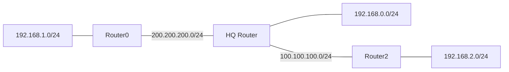

# 🌐 Day 20 — Dynamic Routing with RIP

<!-- portfolio-quick-review:start -->
## ⚡ Quick review

- **Problem:** Static routing requires remote routes to be configured manually on routers.
- **Approach:** I removed the manually configured static routes and enabled RIP so the routers could exchange routing information automatically.
- **Result:** Remote networks appeared in the routing table with the code `R`, showing that they were learned through RIP.
- **Key understanding:** Static routing depends on routes entered by an administrator, while dynamic routing protocols allow routers to learn and update routing information from other routers.
- **Routing protocol:** RIP — Routing Information Protocol.
- **Metric used by RIP:** Hop count.

[Read the full learning notes ↓](#full-learning-notes)

---

<a id="full-learning-notes"></a>
<!-- portfolio-quick-review:end -->

## 📌 What changed from static routing?

In my previous routing labs, I manually told routers how to reach remote networks using commands such as:

```cisco
ip route <destination-network> <subnet-mask> <next-hop-IP>
```

For example:

```cisco
ip route 192.168.1.0 255.255.255.0 200.200.200.1
```

This is **static routing** because I manually create the route.

Today I learned **dynamic routing**.

Instead of configuring every remote route manually, routers can exchange routing information using a routing protocol.

The protocol used in this lab was:

> **RIP — Routing Information Protocol**

My main mental model is:

```text
STATIC ROUTING
Administrator creates routes
        ↓
Router uses those routes
```

```text
DYNAMIC ROUTING
Routers exchange routing information
        ↓
Routers learn remote networks
        ↓
Routing tables update automatically
```

---

## 🎯 What I practiced

- Understanding the difference between static and dynamic routing.
- Removing previously configured static routes.
- Enabling RIP on Cisco routers.
- Advertising directly connected networks through RIP.
- Checking the routing table with `show ip route`.
- Identifying RIP-learned routes using the code `R`.
- Understanding RIP hop count.
- Reading `[120/1]` and `[120/2]` in routing-table entries.
- Checking RIP information using `show ip protocols`.
- Understanding that routing protocols need time to react when network connectivity changes.
- Learning the basic idea of routing convergence.

---

# 🧠 What is dynamic routing?

**Dynamic routing** allows routers to exchange information about the networks they know.

Instead of manually entering:

```cisco
ip route ...
```

for every destination network, I enable a routing protocol.

The routers then exchange routing information with other routers participating in that protocol.

This is useful when a network contains several routers because manually maintaining every route can become difficult.

---

# 🛰️ What is RIP?

**RIP** stands for:

> **Routing Information Protocol**

RIP is a dynamic routing protocol.

Its job is to help routers learn about remote networks from other routers.

RIP mainly chooses between routes using:

> **Hop count**

A **hop** represents passing through a router on the path toward a destination network.

For example:

```text
Router2 → HQ → 192.168.0.0
```

The destination network is one router hop away.

But:

```text
Router2 → HQ → Router0 → 192.168.1.0
```

requires two router hops.

RIP prefers routes with the lower hop count.

---

## 🗺️ My three-router topology

The lab contained three routers:



The main networks were:

| Network | Purpose |
|---|---|
| `192.168.1.0/24` | LAN connected to Router0 |
| `200.200.200.0/24` | Router0 ↔ HQ connection |
| `192.168.0.0/24` | LAN connected to HQ |
| `100.100.100.0/24` | HQ ↔ Router2 connection |
| `192.168.2.0/24` | LAN connected to Router2 |

The routers already know their own directly connected networks.

The problem is learning the networks located behind the other routers.

---

# 🔄 Step 1 — Remove the old static routes

Before enabling RIP, HQ contained manually configured routes such as:

```text
S 192.168.1.0/24 via 200.200.200.1
S 192.168.2.0/24 via 100.100.100.1
```

`S` means:

> **Static route**

To properly observe RIP learning the routes dynamically, I removed the old static routes.

```cisco
enable
configure terminal

no ip route 192.168.2.0 255.255.255.0 100.100.100.1
no ip route 192.168.20.0 255.255.255.0 200.200.200.1
no ip route 192.168.1.0 255.255.255.0 200.200.200.1

end
write memory
```

After removing the static routes, HQ only knew its directly connected networks.

Example:

```text
C 100.100.100.0
C 192.168.0.0/24
C 200.200.200.0/24
```

`C` means:

> **Connected network**

This gave me a clean starting point for observing RIP.

---

# 🔧 Step 2 — Enable RIP

The basic command is:

```cisco
router rip
```

This enters RIP configuration mode.

Example:

```cisco
Router(config)# router rip
Router(config-router)#
```

The router is now ready to be told which connected networks should participate in RIP.

---

# 📢 Step 3 — Advertise connected networks

## Router0

Router0 was connected to:

```text
192.168.1.0/24
200.200.200.0/24
```

The RIP configuration used was:

```cisco
enable
configure terminal

router rip
 version 2
 network 192.168.1.0
 network 200.200.200.0

end
write memory
```

---

## HQ Router

HQ was connected to:

```text
192.168.0.0/24
200.200.200.0/24
100.100.100.0/24
```

The configuration used was:

```cisco
enable
configure terminal

router rip
 network 192.168.0.0
 network 100.100.100.0
 network 200.200.200.0

end
write memory
```

---

## Router2

Router2 was connected to:

```text
100.100.100.0/24
192.168.2.0/24
```

The RIP configuration used was:

```cisco
enable
configure terminal

router rip
 network 100.100.100.0
 network 192.168.2.0

end
write memory
```

---

# ⚠️ What the `network` command actually means

This was an important correction to my understanding.

When I enter:

```cisco
network 192.168.1.0
```

I am **not manually creating a route to `192.168.1.0`**.

The router already knows that network if it is directly connected.

The command tells RIP that the connected network/interface should participate in RIP so routing information can be exchanged with RIP neighbors.

So:

```text
ip route ...
```

and:

```text
network ...
```

have completely different purposes.

---

# 🔎 Step 4 — Check the routing table

After configuring RIP, I used:

```cisco
show ip route
```

Before RIP, HQ mainly displayed connected networks:

```text
C 100.100.100.0
C 192.168.0.0/24
C 200.200.200.0/24
```

After RIP exchanged routing information, HQ learned:

```text
R 192.168.1.0/24 [120/1] via 200.200.200.1
R 192.168.2.0/24 [120/1] via 100.100.100.1
```

The important change was:

```text
R
```

`R` means:

> **The route was learned through RIP.**

This is different from:

```text
C = Connected
S = Static
R = RIP
```

---

# 🔢 Understanding `[120/1]`

One RIP route appeared as:

```text
R 192.168.1.0/24 [120/1] via 200.200.200.1
```

I learned to read:

```text
[120/1]
```

as:

```text
[Administrative Distance / Metric]
```

For RIP:

```text
120 = Administrative Distance
1   = Hop Count
```

### Administrative Distance

**Administrative Distance (AD)** represents how trustworthy a routing-information source is considered by the router.

RIP uses an administrative distance of:

```text
120
```

### Metric

A **metric** is the value a routing protocol uses to compare possible routes.

RIP uses:

```text
Hop Count
```

---

# 🪜 Understanding hop count from my topology

Router2 learned:

```text
R 192.168.0.0/24 [120/1]
```

because the path is:

```text
Router2 → HQ → 192.168.0.0
```

That network is one router hop away.

Router2 also learned:

```text
R 192.168.1.0/24 [120/2]
```

because the path is:

```text
Router2 → HQ → Router0 → 192.168.1.0
```

The network is two router hops away.

This helped me understand what RIP's metric actually represents.

---

# 🔄 How routers learn from each other

The routers exchange information approximately like this:

```text
Router0
"I know 192.168.1.0"
        ↓
       HQ
        ↓
Router2 learns that network through HQ
```

Router2 also advertises its own network:

```text
Router2
"I know 192.168.2.0"
        ↓
       HQ
        ↓
Router0 can learn about it
```

Therefore I do not need to manually create every remote route with `ip route`.

The routing protocol handles the exchange.

---

# ⏱️ RIP updates and timers

I used:

```cisco
show ip protocols
```

The output showed that RIP was running and sending routing updates periodically.

The lab displayed information including:

```text
Routing Protocol is "rip"

Sending updates every 30 seconds

Invalid after 180 seconds
hold down 180
flushed after 240
```

The most important point for me is:

> RIP does not instantly know every change in the network.

Routers exchange information and need some time to update their routing tables.

---

# 🔄 What is convergence?

**Convergence** is the process of routers updating their routing information after the network changes until the routers have a consistent view of reachable routes again.

For example:

```text
Normal network
Router A → Router B → Destination
```

If the path becomes unavailable:

```text
Router A → X Router B
```

a dynamic routing protocol eventually learns that the old path should no longer be used.

If another usable route exists, the routing protocol may learn and use it.

The time needed to react and update routing information is related to **convergence**.

---

# ⚠️ Route failure observed in my lab

During the lab, one routing-table entry changed to:

```text
R 192.168.2.0/24 is possibly down,
routing via 100.100.100.1
```

This showed me that RIP was reacting to a change involving that learned route.

A dynamic routing protocol does not mean there can never be packet loss.

While routers are detecting a network change and updating routing information, traffic can temporarily fail.

The important idea is:

> Dynamic routing can react to topology changes, but the update process is not necessarily instantaneous.

---

# 🆚 Static routing vs RIP

| Static Routing | RIP Dynamic Routing |
|---|---|
| Routes are entered manually | Routes can be learned from other routers |
| Uses `ip route` | Uses `router rip` |
| Appears as `S` in the routing table | Appears as `R` |
| Administrator provides the next hop | RIP exchanges routing information |
| Does not automatically learn normal topology changes | RIP can update learned routes |
| Easy for small/simple networks | Reduces manual routing work as networks grow |

My simplest mental model is:

> **Static routing:** I tell the router where the network is.

> **Dynamic routing:** Routers tell each other which networks they know.

---

# ⭐ Static and dynamic routes can exist together

One thing I noticed in this lab is that enabling RIP did not automatically mean every static route disappeared.

For example, an edge router could still contain:

```text
S* 0.0.0.0/0
```

while also having routes learned through RIP.

`S*` represents a static candidate default route.

So:

> Static routing and dynamic routing are not mutually exclusive.

A router can contain connected routes, static routes, default routes, and dynamically learned routes at the same time.

---

# 🧪 Commands I learned

| Command | Purpose |
|---|---|
| `enable` | Enter privileged EXEC mode |
| `configure terminal` | Enter global configuration mode |
| `show ip route` | Display the routing table |
| `ip route ...` | Create a static route |
| `no ip route ...` | Remove a static route |
| `router rip` | Enable/configure RIP |
| `version 2` | Configure RIP version 2 |
| `network <network>` | Make a connected network participate in RIP |
| `show ip protocols` | Display information about active routing protocols |
| `write memory` / `wr` | Save the running configuration |

---

# 💻 Basic RIP command pattern

For future practice, the general structure I need to remember is:

```cisco
enable
configure terminal

router rip
 version 2
 network <directly-connected-network>
 network <directly-connected-network>

end

write memory

show ip route
show ip protocols
```

The exact `network` commands depend on the networks directly connected to that router.

---

# 🔍 Useful routing-table codes

| Code | Meaning |
|---|---|
| `C` | Connected |
| `S` | Static |
| `S*` | Candidate default static route |
| `R` | RIP |
| `O` | OSPF |
| `D` | EIGRP |

For today's lab, the most important ones were:

```text
C
S
R
```

---

# 🛠️ Mistakes I learned from

## 1. Running `no ip route` in the wrong CLI mode

I initially tried:

```cisco
Router# no ip route ...
```

The command was rejected.

`no ip route` is a configuration command, so I needed:

```cisco
Router# configure terminal
Router(config)# no ip route ...
```

---

## 2. Running `show` commands in configuration mode

I also attempted commands such as:

```cisco
Router(config)# show ip route
```

The normal place to run the command is privileged EXEC mode:

```cisco
Router#
```

So I use:

```cisco
Router(config)# end
Router# show ip route
```

This reinforced the importance of checking the Cisco CLI prompt before entering a command.

---

## 3. `network` does not mean “create this route”

This was one of the biggest conceptual differences from static routing.

```cisco
network 192.168.1.0
```

does not mean:

> “Create a route to 192.168.1.0.”

It tells RIP that this connected network should participate in the routing protocol.

Remote routes are then learned through RIP exchanges.

---

# 📝 RIP version observation from my lab

In my recorded configuration, Router0 explicitly used:

```cisco
version 2
```

while the HQ router's `show ip protocols` output showed its default version behavior.

This means my recorded classroom configuration was not completely identical on every router.

The important lesson from this lab was understanding RIP itself.

For a clean RIPv2 practice lab, I should configure:

```cisco
router rip
 version 2
```

consistently on all participating routers.

---

# 🔍 My troubleshooting order for RIP

If RIP routes are not appearing, I will check:

1. Are the router interfaces correctly addressed and `up/up`?
2. Does `show ip route` display the expected directly connected `C` networks?
3. Is RIP configured using `router rip`?
4. Did I include the correct directly connected networks under RIP?
5. Are neighboring routers also participating in RIP?
6. Does `show ip protocols` confirm RIP is running?
7. Does `show ip route` show remote networks with `R`?
8. Is the route currently being treated as unavailable or possibly down?
9. Can the end devices successfully ping across the topology?

Useful commands:

```cisco
show ip interface brief
show ip route
show ip protocols
show running-config
ping <destination-IP>
```

---

# 🔐 Why this matters for cybersecurity

Understanding routing is important when troubleshooting communication failures.

If a device cannot reach another network, the problem is not automatically:

- a firewall,
- malware,
- a blocked port,
- or a failed server.

The router may simply:

- not know the destination network,
- have an incorrect route,
- have lost a neighboring route,
- or still be updating its routing information after a topology change.

Dynamic routing knowledge helps me determine:

> **Where should this packet go, how did the router learn that path, and what happens if that path disappears?**

This is useful when analyzing outages, packet loss, network segmentation problems, firewall paths, and security incidents.

---

# 🧠 My Day 20 takeaway

Before this lab, I understood routing mainly as manually creating routes using `ip route`.

Today I learned that routers can also learn remote networks dynamically.

With RIP:

```text
router rip
```

starts the RIP process, while:

```text
network ...
```

selects connected networks that participate in RIP.

After the routers exchange routing information, dynamically learned routes appear as:

```text
R
```

in:

```cisco
show ip route
```

I also learned to interpret:

```text
[120/1]
```

as:

```text
120 = RIP administrative distance
1   = RIP hop-count metric
```

The most important difference I will remember is:

> **Static routing = I maintain the routes manually.**

> **Dynamic routing = routers exchange information and help maintain their routing tables automatically.**

---

## ✅ Quick self-check

1. What does RIP stand for?
2. What is the difference between a static route and a RIP-learned route?
3. What does `R` mean in `show ip route`?
4. What does `[120/2]` mean for a RIP route?
5. What metric does RIP use?
6. Does `network 192.168.1.0` manually create a route to that network?
7. What does `show ip protocols` tell me?
8. What does convergence mean?
9. Can static and dynamic routes exist on the same router?

<details>
<summary>Check my understanding</summary>

1. **Routing Information Protocol.**
2. A static route is configured manually; a RIP route is learned through RIP.
3. `R` means the route was learned through RIP.
4. `120` is RIP's administrative distance and `2` is the hop-count metric.
5. RIP uses hop count.
6. No. It makes the connected network participate in RIP.
7. It shows information about the dynamic routing protocols running on the router.
8. Convergence is the process of routers updating their routing information after the network changes.
9. Yes. Static, connected, default, and dynamically learned routes can exist together.

</details>

---

## 📍 Next learning

The next dynamic routing protocol I will study is:

**OSPF — Open Shortest Path First**

RIP introduced the idea of routers automatically exchanging routing information. OSPF will build on the same dynamic-routing foundation while using a different method to calculate routes.
