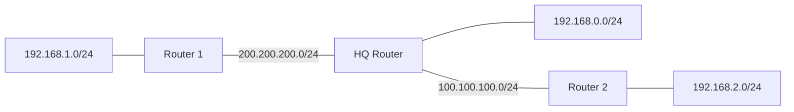

# 🌐 Day 21 — Dynamic Routing with OSPF

<!-- portfolio-quick-review:start -->

## ⚡ Quick review

* **Topic:** OSPF — Open Shortest Path First.
* **Purpose:** Dynamically learn remote networks without manually creating every route.
* **Routing-table code:** `O`
* **Administrative Distance:** `110`
* **Metric:** Cost.
* **Important concept:** OSPF routers form neighbor relationships before exchanging routing information.
* **Backbone:** `Area 0`
* **Key lesson:** A `FULL` OSPF neighbor does not automatically mean every LAN is being advertised.

[Read the full learning notes ↓](#full-learning-notes)

---

<a id="full-learning-notes"></a>

<!-- portfolio-quick-review:end -->

## 🎯 What I practiced

Today I practiced:

* Configuring OSPF in Cisco Packet Tracer.
* Advertising directly connected networks.
* Understanding OSPF process IDs.
* Understanding OSPF areas and `Area 0`.
* Checking OSPF neighbors.
* Identifying OSPF routes in the routing table.
* Understanding wildcard masks.
* Understanding Router IDs.
* Troubleshooting a missing OSPF route.
* Understanding ABRs — Area Border Routers.
* Understanding the difference between neighbor formation and route advertisement.

---

# 🧠 What is OSPF?

**OSPF** stands for:

> **Open Shortest Path First**

OSPF is a **dynamic link-state routing protocol**.

Instead of manually configuring every remote network using:

```cisco
ip route ...
```

routers running OSPF exchange routing information and calculate paths to remote networks.

My basic mental model is:

```text
Connected networks
        ↓
Advertised into OSPF
        ↓
OSPF routers become neighbors
        ↓
Routing information is exchanged
        ↓
Remote networks appear in the routing table
```

---

# 🗺️ My OSPF topology

The lab contained three routers:



The main networks were:

| Network            | Purpose       |
| ------------------ | ------------- |
| `192.168.1.0/24`   | Router 1 LAN  |
| `200.200.200.0/24` | Router 1 ↔ HQ |
| `192.168.0.0/24`   | HQ LAN        |
| `100.100.100.0/24` | HQ ↔ Router 2 |
| `192.168.2.0/24`   | Router 2 LAN  |

---

# 🔧 Basic OSPF configuration

The general OSPF configuration pattern I learned is:

```cisco
enable
configure terminal

router ospf 10
 network <network-address> <wildcard-mask> area 0

end
write memory
```

For example:

```cisco
router ospf 10
 network 192.168.0.0 0.0.0.255 area 0
 network 200.200.200.0 0.0.0.255 area 0
 network 100.100.100.0 0.0.0.255 area 0
```

---

# 🔢 What does `router ospf 10` mean?

```cisco
router ospf 10
```

The `10` is the:

> **OSPF Process ID**

The process ID is **locally significant**.

That means neighboring routers do **not** need matching process numbers.

This can work:

```text
Router 1 → OSPF 20
HQ       → OSPF 10
Router 2 → OSPF 50
```

The process ID mainly identifies the OSPF process inside that particular router.

---

# ⚠️ Two OSPF processes are actually separate

One misconception I cleared today was thinking:

```cisco
router ospf 10
```

and:

```cisco
router ospf 1215
```

were basically the same OSPF configuration.

They are not.

They create **two separate OSPF processes** on that router.

For example:

```text
OSPF Process 10
├── Network A
└── Network B

OSPF Process 1215
└── Network C
```

Routes learned by one OSPF process are not automatically shared with the other process.

For a simple lab, keeping all required networks inside one OSPF process is much cleaner.

To completely remove an OSPF process:

```cisco
configure terminal
no router ospf 10
end
```

Then it can be configured again correctly.

---

# 🌍 What does `area 0` mean?

OSPF can divide a large network into multiple **areas**.

`Area 0` is special because it is the:

> **OSPF Backbone Area**

For a small lab, all routers can simply use:

```text
Area 0
```

Example:

```text
              AREA 0

Router 1 -------- HQ -------- Router 2
```

In larger networks:

```text
AREA 1
   |
  ABR
   |
AREA 0
   |
  ABR
   |
AREA 2
```

Traffic and routing information between different OSPF areas normally use the Area 0 backbone.

---

# ⭐ Process ID vs Area ID

This was one of my most important corrections.

## Process ID

```cisco
router ospf 10
```

The process ID:

* is local to the router,
* does not need to match its neighbor.

Example:

```text
Router A → OSPF 10
Router B → OSPF 50
```

This can work.

## Area ID

```cisco
network 200.200.200.0 0.0.0.255 area 0
```

The area must match between OSPF neighbors on the **same link**.

This works:

```text
Router A interface → Area 0
Router B interface → Area 0
```

This does not:

```text
Router A interface → Area 0
Router B interface → Area 1
```

The routers would not form the expected OSPF adjacency on that link.

---

# 🌉 What is an ABR?

**ABR** stands for:

> **Area Border Router**

An ABR participates in:

```text
Area 0 + another OSPF area
```

Example:

```text
AREA 3 ---- Router ---- AREA 0
              ↑
             ABR
```

The router does not have to be called:

* Headquarters,
* Main Router,
* Central Router.

Any router can become an ABR if its OSPF interfaces connect Area 0 and another area.

For example:

```text
Interface 1 → Area 3
Interface 2 → Area 0
```

That router is an ABR.

---

# 🛣️ Communication between OSPF areas

If a device in Area 3 needs to reach Area 2, the normal OSPF design is:

```text
Area 3
   ↓
ABR
   ↓
Area 0
   ↓
ABR
   ↓
Area 2
```

My mental model is:

> **Area 0 is the backbone connecting the other OSPF areas.**

Area 0 does not mean one special router.

Area 0 itself can contain many routers and many links.

---

# 🎭 Wildcard mask

OSPF network statements use a **wildcard mask**.

For a `/24` network:

```text
Subnet mask   = 255.255.255.0
Wildcard mask = 0.0.0.255
```

Example:

```cisco
network 192.168.2.0 0.0.0.255 area 0
```

One mistake I made was:

```cisco
0.0.0.0.255
```

which is invalid because an IPv4 wildcard mask contains only four octets.

Correct:

```cisco
0.0.0.255
```

---

# 🤝 Checking OSPF neighbors

I used:

```cisco
show ip ospf neighbor
```

Example:

```text
Neighbor ID      State       Address
200.200.200.1    FULL/BDR    200.200.200.1
192.168.2.254    FULL/-      100.100.100.1
```

The most important state I looked for was:

```text
FULL
```

`FULL` means the routers successfully formed an OSPF adjacency and synchronized their OSPF information.

---

# 🆔 Neighbor ID vs Address

I noticed output such as:

```text
Neighbor ID: 192.168.2.254
Address:     100.100.100.1
```

These do not have to be identical.

```text
Neighbor ID = OSPF Router ID
Address     = Neighbor interface IP used on that connection
```

The **Router ID** identifies the router inside OSPF.

The **Address** shows where that neighbor is reached on the connected link.

---

# 🔎 Checking OSPF routes

I used:

```cisco
show ip route
```

OSPF-learned networks appear with:

```text
O
```

Example:

```text
O 192.168.1.0/24 [110/2] via 200.200.200.1
```

Important routing codes:

| Code | Meaning   |
| ---- | --------- |
| `C`  | Connected |
| `S`  | Static    |
| `R`  | RIP       |
| `O`  | OSPF      |

For OSPF:

```text
[110/2]
```

means approximately:

```text
110 = OSPF Administrative Distance
2   = OSPF Cost for that route
```

OSPF uses **cost** as its routing metric.

---

# 🐛 Important troubleshooting lesson

One of the most useful things I learned today was:

> **FULL neighbor does not mean every remote network is being advertised.**

In my lab, Router 2 showed:

```text
C 192.168.2.0/24
```

meaning the LAN existed and was directly connected.

The routers also showed:

```text
FULL
```

meaning the OSPF neighbor relationship worked.

But HQ did not initially show:

```text
O 192.168.2.0/24
```

The missing network needed to participate in OSPF:

```cisco
router ospf 10
 network 192.168.2.0 0.0.0.255 area 0
```

After that, HQ could learn the route.

So troubleshooting should separate:

```text
Neighbor formation
        ↓
Is the neighbor FULL?

Route advertisement
        ↓
Is the remote LAN actually being advertised?
```

They are related, but they are not the same thing.

---

# 🔍 My OSPF troubleshooting order

If ping fails, I should check in this order:

```text
1. Are interfaces up?
        ↓
2. Are connected networks present?
        ↓
3. Is OSPF configured?
        ↓
4. Are neighbors FULL?
        ↓
5. Are all required LANs advertised?
        ↓
6. Are OSPF routes appearing with O?
        ↓
7. Can I ping the next-hop router?
        ↓
8. Can I ping the remote router interface?
        ↓
9. Can I ping the final PC?
```

Useful commands:

```cisco
show ip interface brief
show ip route
show ip ospf neighbor
show ip protocols
show running-config
ping <destination-IP>
```

---

# 🧪 Commands I learned today

| Command                               | Purpose                                      |
| ------------------------------------- | -------------------------------------------- |
| `router ospf 10`                      | Create/enter OSPF process 10                 |
| `network <network> <wildcard> area 0` | Make matching interfaces participate in OSPF |
| `show ip ospf neighbor`               | Check OSPF neighbors                         |
| `show ip route`                       | View connected and learned routes            |
| `show ip protocols`                   | View active routing protocol information     |
| `no router ospf 10`                   | Remove OSPF process 10                       |
| `show ip interface brief`             | Quickly check interface IPs and status       |
| `write memory` / `wr`                 | Save configuration                           |
| `ping <IP>`                           | Test connectivity                            |

---

# ❌ Misconceptions I cleared

### ❌ Process numbers must match

Wrong:

```text
Router A → OSPF 10
Router B → OSPF 20
```

does **not** automatically cause a problem.

✅ OSPF process IDs are locally significant.

---

### ❌ One router can only belong to one area

Wrong.

A router can have:

```text
Interface 1 → Area 0
Interface 2 → Area 2
```

That router can act as an **ABR**.

---

### ❌ Only headquarters can be an ABR

Wrong.

Any router connecting:

```text
Area 0 ↔ another area
```

can act as an ABR.

---

### ❌ FULL neighbor means routing must work

Not necessarily.

```text
FULL ✅
```

only confirms that the OSPF adjacency formed successfully.

The required LAN still needs to participate in OSPF.

---

### ❌ Area 0 means one central router

Wrong.

Area 0 is the **backbone area**, not a single router.

It may contain multiple routers and connections.

---

# 💻 OSPF command pattern to remember

```cisco
enable
configure terminal

router ospf 10

network <connected-network> <wildcard-mask> area 0
network <connected-network> <wildcard-mask> area 0

end
write memory

show ip ospf neighbor
show ip route
show ip protocols
```

For a `/24`:

```text
Subnet mask   → 255.255.255.0
Wildcard mask → 0.0.0.255
```

---

# 🔐 Why this matters for cybersecurity

Understanding OSPF helps me troubleshoot whether a communication problem is actually caused by:

* missing routing information,
* incorrect OSPF configuration,
* missing network advertisements,
* broken neighbor relationships,
* wrong area configuration,
* or an actual security control such as a firewall.

Before assuming traffic is being blocked, I should first confirm:

> **Does the router actually know how to reach the destination network?**

---

# 🧠 My Day 21 takeaway

Today I moved from RIP into OSPF and learned that OSPF has more structure.

The most important things I will remember are:

```text
OSPF = Open Shortest Path First

O = OSPF-learned route

110 = OSPF Administrative Distance

Process ID = local to the router

Area ID = must match between OSPF neighbors on the same link

Area 0 = OSPF backbone

ABR = router connecting Area 0 with another area

FULL = OSPF neighbor relationship successfully formed
```

Most importantly:

> **Process ID tells the router which OSPF process I am configuring.**

> **Area ID describes where an OSPF interface belongs in the OSPF topology.**

> **A FULL neighbor does not guarantee that every LAN is being advertised.**

That final troubleshooting lesson helped me understand OSPF beyond simply memorizing the commands.

---

## ✅ Quick self-check

1. What does OSPF stand for?
2. What does `O` represent in `show ip route`?
3. Do neighboring OSPF process IDs need to match?
4. What is special about Area 0?
5. What is an ABR?
6. Can one router participate in multiple OSPF areas?
7. What does `FULL` mean in `show ip ospf neighbor`?
8. Does `FULL` guarantee every LAN is advertised?
9. What wildcard mask represents a `/24`?
10. What is the difference between a Router ID and neighbor interface address?

<details>
<summary>Check my understanding</summary>

1. **Open Shortest Path First.**
2. `O` means the route was learned through OSPF.
3. No. OSPF process IDs are locally significant.
4. Area 0 is the OSPF backbone area.
5. An ABR connects Area 0 with another OSPF area.
6. Yes.
7. The OSPF adjacency has successfully formed.
8. No. The required network must still participate in OSPF.
9. `0.0.0.255`
10. Router ID identifies the OSPF router; the neighbor address is the interface address used to reach it.

</details>

---

## 📍 Day 21 complete

**Dynamic Routing with OSPF ✅**

Today I learned not only how to configure OSPF, but how to **read, verify, and troubleshoot it instead of blindly entering commands**.
