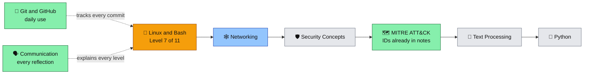

cd ~/cybersecurity-portfolio
cat > README.md << 'EOF'
<div align="center">

<h1>🛡️ Cybersecurity Portfolio</h1>
<h3>Abishek Jogi Mokarla — cybersecurity from the ground up</h3>
<p>Hyderabad, India</p>


</div>

Hands-on, documentation-first learning portfolio. Every level here was built by
typing the commands, hitting the bugs, and writing down both — the working
version and the failures that taught more than the fix did.

> [!TIP]
> **Visitor with two minutes?** Read [`suspicious_hunter.sh`](tools/suspicious_hunter.sh) and its [build log](tools/README.md) — together they show both the tool and how I work.

---

## 🔧 Tools Built

| Tool | What it does | Highlights |
|---|---|---|
| [`suspicious_hunter.sh`](tools/suspicious_hunter.sh) | Directory threat hunter — scans for world-writable files, SUID/SGID binaries, files modified in the last 24h, and oversized files; prints live and saves a dated report via `tee` | Maps to MITRE ATT&CK **T1548.001**; every check validated by planting dirty data and catching exactly that ([full build log](tools/README.md)) |
| [`audit.sh`](linux-fundamentals/level-7-scripts/7.2-arguments-permanence-and-audit-tool/audit.sh) | Directory auditor — dated report with file count and a permission-rich, time-sorted listing | First tool built from a written spec with no code handed to me |
| `fcd` | Defensive navigation function — distinct, truthful messages for empty input, missing target, wrong type, and success | Documented with the 3 real bugs hit on the way ([write-up](linux-fundamentals/level-5-functions-and-conditions/5.4-file-conditions/README.md)) |
| 6 loop-control patterns | File-integrity monitor, critical-content alarm (`grep -q`), pattern-skip, flexible any-arguments monitor, `while true` production monitor, self-protecting classifier | The break/continue chapter, built as real security-monitoring shapes ([notes](linux-fundamentals/level-6-loops/6.3-break-and-continue/FINAL-commands-learned.md)) |
| Cleanup tool v2 | Pattern-protected delete with **dry-run mode** | Born from real data loss — a quoted wildcard killed the protect-check and deleted my shell files; dry-run became a permanent rule ([story](linux-fundamentals/level-6-loops/6.2b-bash-automation/reflections.md)) |

---

## 📈 Progress — Linux & Bash (Hero 1 of 8)

**Level 7 of 11 in progress** · started 24 Apr 2026 · last update 2 Jul 2026
✅ complete · 🟡 in progress · ⏳ upcoming

| Level | Topic | Status |
|---|---|---|
| 1 | Terminal basics — `pwd`, `ls`, `cd`, `history` | ✅ Apr 2026 |
| 2 | Files & directories — `mkdir`, `touch`, `cat`, `cp`, `mv`, `rm`, `nano` | ✅ Apr 2026 |
| 3 | Permissions — rwx, numeric & symbolic `chmod`, ownership, DAC | ✅ Apr 2026 |
| 4 | Variables & environment — expansion, `$PATH`, `export`, aliases, `.bashrc` | ✅ May 2026 |
| 5 | Functions & conditions — arguments, `test` and exit codes, file tests, `fcd` capstone | ✅ 15–24 May 2026 |
| 6 | Loops — `for`, `while`, nesting, `break`/`continue` as 6 security patterns | ✅ 29 May – 18 Jun 2026 |
| 7 | Scripts & `find` — shebang, `chmod +x`, PATH permanence, `audit.sh`, `suspicious_hunter.sh` | 🟡 7.1–7.2 ✅ · 7.3 learned · final assembly next |
| 8–11 | Processes · system info · cron · SSH | ⏳ upcoming |

Each level folder holds two files: **`commands-learned.md`** (the technical
reference) and **`reflections.md`** (what broke, what clicked, and what changed
in how I think). [`PROGRESS.md`](PROGRESS.md) is the running session log.

---

## 🧠 What this repo demonstrates

- **Building from specs, not copying code** — `audit.sh` and `suspicious_hunter.sh` were assembled from written requirements, every failure debugged personally.
- **Validation discipline** — empty output is not proof of correctness. Checks are proven by planting bad data (a `chmod 762` folder, a root-owned file via `sudo touch`) and watching the tool catch exactly that.
- **Silent-failure hunting** — found and fixed false-negative bugs: `-perm 4000` vs `-perm -4000`, the `find -size` rounding trap, the `while`+`continue` freeze. The bug class that matters most in security tooling.
- **Safe automation habits** — dry-run before any destructive loop, test copies before editing working scripts, `&&` gating before dangerous commands.
- **Security framing throughout** — `$PATH` hijacking (T1574.007), `.bashrc` persistence (T1546.004), SUID/SGID abuse (T1548.001), permissions as Discretionary Access Control.

---

## 🗺️ The Roadmap — "The Spine"

Eight connected domains, learned in order, each linking forward:



🟨 current · 🟦 next · 🟩 in daily use · ⬜ upcoming

<details>
<summary><b>Full hero table</b></summary>

| Hero | Domain | Status |
|---|---|---|
| 🦾 Iron Man | Linux & Bash | 🟡 Level 7 of 11 |
| 🕸️ Spider-Man | Networking | next |
| 🛡️ Captain America | Security Concepts | upcoming |
| 🗺️ Nick Fury | MITRE ATT&CK | woven in — technique IDs throughout the notes |
| 📝 Hawkeye | Text Processing | upcoming |
| 🐍 Bruce Banner | Python | upcoming |
| 🐙 J.A.R.V.I.S | Git & GitHub | in daily use |
| 🗣️ Black Widow | Professional Communication | practiced in every reflection |

</details>

---

<details>
<summary><b>📁 Repository structure</b></summary>

```text
cybersecurity-portfolio/
├── README.md                  ← you are here
├── PROGRESS.md                ← running session log
├── security-checklist.md      ← placeholder — written at the Linux final boss (Level 11)
├── tools/
│   ├── suspicious_hunter.sh   ← directory threat hunter + full build log
│   └── README.md
└── linux-fundamentals/
    ├── level-1-terminal-basics/
    ├── level-2-files-and-directories/
    ├── level-3-permissions/
    ├── level-4-variables-and-environment/
    ├── level-5-functions-and-conditions/   (5.1–5.4 + fcd capstone)
    ├── level-6-loops/                      (6.1, 6.2a–c, 6.3 + the 6 patterns)
    └── level-7-scripts/                    (7.1, 7.2 + audit.sh)
```

New folders appear when their hero actually starts — nothing listed here is a promise.

</details>

---

> [!NOTE]
> **Environment.** This portfolio began on an **Android phone running Termux** — the first levels were built with no laptop at all, just a terminal and time. The work now continues on **Ubuntu (VirtualBox)**, which unlocks the multi-user topics parked earlier: `chown`, real process management, cron, and SSH.

> Documenting learning is as important as learning itself. The failures stay in
> the notes on purpose — they're where the real lessons live.

---

## 📬 Contact

- **GitHub:** https://github.com/jmabishek
- **Location:** Hyderabad, India
- **Status:** Actively learning · Open to internship opportunities · Open to relocation

---

<details>
<summary><b>🕰️ Where this started — day 2, preserved typos and all</b></summary>

> hi guys
> my name ia abhi
> i uave started my journy in cyber security
> And this is my first step towards my goal
> i will update my journy and challanges as i go
> for now lets end it uere on day 2 2026 apr 25

</details>

Open that, then scroll back up — that's the distance travelled so far.
EOF
